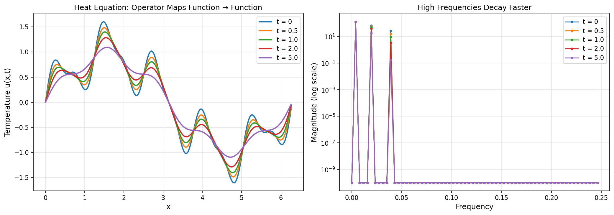
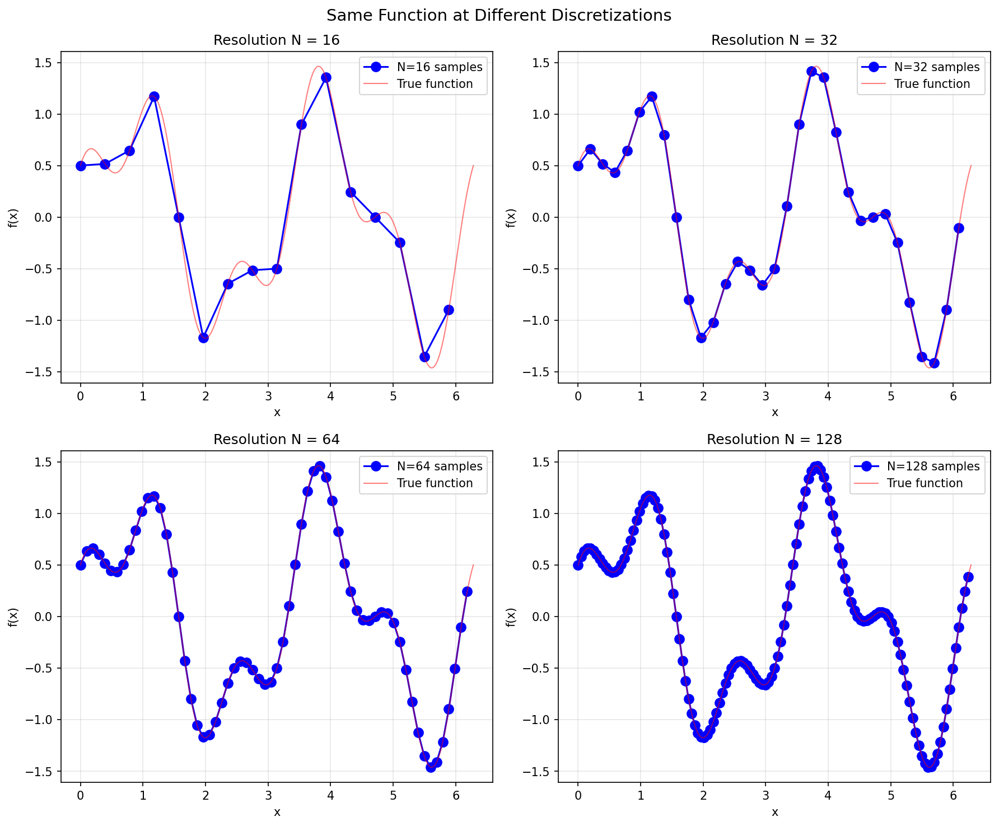
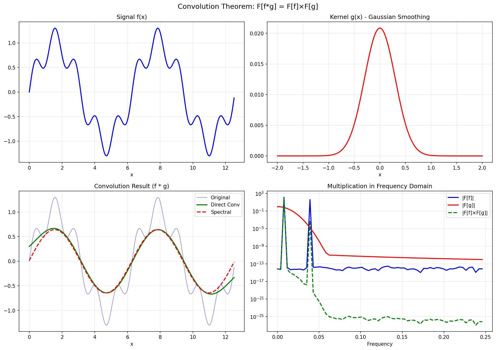
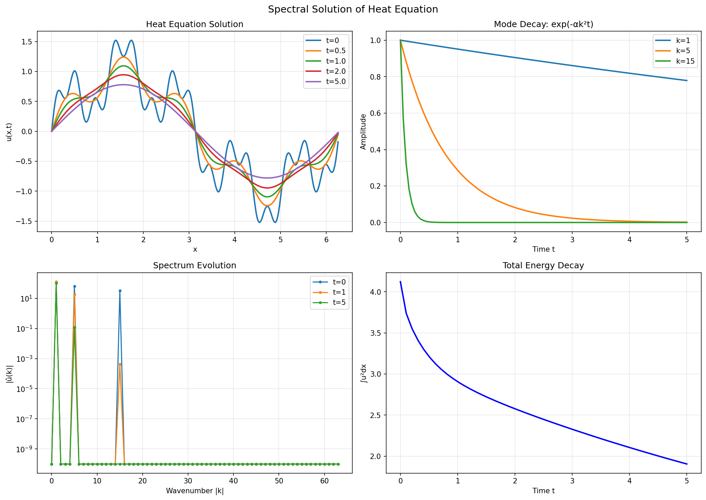

# Fourier Neural Operator: Chunk 1
## Mathematical Foundations - Complete Tutorial with Code

---

# Introduction

This tutorial covers the **mathematical foundations** you need before implementing FNO. By the end, you will have deep understanding of:

1. **What operators are** and why they differ from functions
2. **The Fourier Transform** from first principles
3. **Key properties** that make spectral methods powerful for PDEs

Each concept is followed immediately by **code implementation** and **visualizations** so you can see the theory in action.

---

## Setup: Import Libraries

First, let's set up our environment:

```python
"""
Fourier Neural Operator - Chunk 1: Mathematical Foundations
============================================================
Run this code alongside the theory to build deep intuition.
"""

import numpy as np
import matplotlib.pyplot as plt
from typing import Tuple, Callable
import warnings
warnings.filterwarnings('ignore')

# Create output directory for figures
import os
os.makedirs('figures', exist_ok=True)

np.random.seed(42)

print("=" * 70)
print("CHUNK 1: MATHEMATICAL FOUNDATIONS FOR FNO")
print("=" * 70)
```

---

# Section 1: Functions vs Operators

## 1.1 What Neural Networks Traditionally Learn

A standard neural network learns a **function**:

$$f_\theta: \mathbb{R}^n \rightarrow \mathbb{R}^m$$

This maps a finite-dimensional input to a finite-dimensional output.

**Examples:**
| Task | Input | Output | Mapping |
|------|-------|--------|---------|
| Image classification | 224×224×3 image | 1000 class probabilities | $\mathbb{R}^{150528} \rightarrow \mathbb{R}^{1000}$ |
| House price prediction | 10 features | 1 price | $\mathbb{R}^{10} \rightarrow \mathbb{R}$ |
| Weather prediction (pointwise) | 20 atmospheric variables | 1 temperature | $\mathbb{R}^{20} \rightarrow \mathbb{R}$ |

**The critical limitation:** The dimensions are **fixed**. If you train on 64×64 grids, you cannot directly use the model on 128×128 grids.

### 💻 Code: Demonstrating Functions

```python
def demonstrate_function():
    """
    A FUNCTION maps a number (or vector) to a number (or vector).
    The dimensions are FIXED.
    """
    print("\n--- 1.1: What is a Function? ---\n")
    
    # Example: A simple function f: R -> R
    def f(x: float) -> float:
        return np.sin(x) + 0.5 * x
    
    # We can evaluate it at specific points
    print("Function f(x) = sin(x) + 0.5x")
    print(f"  f(0) = {f(0):.4f}")
    print(f"  f(π) = {f(np.pi):.4f}")
    print(f"  f(2π) = {f(2*np.pi):.4f}")
    
    # The input is a NUMBER, output is a NUMBER
    print("\n  Input dimension: 1 (a scalar)")
    print("  Output dimension: 1 (a scalar)")
    print("  This is FIXED - cannot change.")
    
    # A neural network for regression is like this
    print("\n  A typical ML regression model:")
    print("    Input: 20 features at ONE location")
    print("    Output: 1 prediction at that location")
    print("    Fixed dimensions: R^20 -> R^1")

demonstrate_function()
```

**Output:**
```
--- 1.1: What is a Function? ---

Function f(x) = sin(x) + 0.5x
  f(0) = 0.0000
  f(π) = 1.5708
  f(2π) = 3.1416

  Input dimension: 1 (a scalar)
  Output dimension: 1 (a scalar)
  This is FIXED - cannot change.
```

---

## 1.2 What is an Operator?

An **operator** maps between **function spaces**:

$$\mathcal{G}: \mathcal{A} \rightarrow \mathcal{U}$$

Where $\mathcal{A}$ and $\mathcal{U}$ are spaces of functions (infinite-dimensional).

**The key difference:**
- Function: Takes a **vector** (finite list of numbers), outputs a **vector**
- Operator: Takes an **entire function** (infinite information), outputs an **entire function**

## 1.3 Concrete Example: The Heat Equation

Consider the 1D heat equation on a rod:

$$\frac{\partial u}{\partial t} = \alpha \frac{\partial^2 u}{\partial x^2}$$

Where:
- $u(x, t)$ = temperature at position $x$ and time $t$
- $\alpha$ = thermal diffusivity (material property)

**The solution operator $\mathcal{G}_T$:**

Given initial temperature distribution $a(x) = u(x, 0)$, the solution at time $T$ is:

$$u(x, T) = \mathcal{G}_T[a](x)$$

This operator:
- **Input:** The function $a(x)$ — temperature everywhere along the rod at $t=0$
- **Output:** The function $u(x,T)$ — temperature everywhere along the rod at $t=T$

It's not mapping a few numbers to a few numbers. It's mapping an **entire temperature profile** to another **entire temperature profile**.

### 💻 Code: Demonstrating Operators with Heat Equation

```python
def demonstrate_operator():
    """
    An OPERATOR maps a function to a function.
    It works on ENTIRE functions, not individual values.
    """
    print("\n--- 1.2: What is an Operator? ---\n")
    
    def heat_solution_operator(
        initial_condition: np.ndarray,
        x: np.ndarray,
        t: float,
        alpha: float = 0.01
    ) -> np.ndarray:
        """
        Solve heat equation: du/dt = alpha * d²u/dx²
        
        This is an OPERATOR because:
        - Input: entire function a(x) represented as array
        - Output: entire function u(x,t) represented as array
        """
        N = len(initial_condition)
        L = x[-1] - x[0]
        dx = L / N
        
        # Solve in Fourier space (we'll learn why this works!)
        a_hat = np.fft.fft(initial_condition)
        k = np.fft.fftfreq(N, d=dx) * 2 * np.pi  # Wavenumbers
        
        # Each Fourier mode decays exponentially
        decay = np.exp(-alpha * k**2 * t)
        u_hat = a_hat * decay
        
        u = np.fft.ifft(u_hat).real
        return u
    
    # Create spatial grid
    N = 256
    x = np.linspace(0, 2*np.pi, N, endpoint=False)
    
    # Create initial condition (a FUNCTION, not a number)
    initial_temp = np.sin(x) + 0.5 * np.sin(5*x) + 0.2 * np.sin(10*x)
    
    print("Heat equation solution operator G:")
    print(f"  Input: initial temperature a(x) — a function over [0, 2π]")
    print(f"         Represented as {N} values, but conceptually continuous")
    print(f"  Output: temperature u(x,t) — another function over [0, 2π]")
    
    # Apply operator at different times
    times = [0, 0.5, 1.0, 2.0, 5.0]
    solutions = [heat_solution_operator(initial_temp, x, t) for t in times]
    
    # Visualize
    fig, axes = plt.subplots(1, 2, figsize=(14, 5))
    
    # Plot solutions at different times
    for t, u in zip(times, solutions):
        axes[0].plot(x, u, linewidth=2, label=f't = {t}')
    axes[0].set_xlabel('x', fontsize=12)
    axes[0].set_ylabel('Temperature u(x,t)', fontsize=12)
    axes[0].set_title('Heat Equation: Operator Maps Function → Function', fontsize=12)
    axes[0].legend()
    axes[0].grid(True, alpha=0.3)
    
    # Show what happens to frequency content
    for t, u in zip(times, solutions):
        u_hat = np.fft.fft(u)
        freq = np.fft.fftfreq(N)
        axes[1].semilogy(freq[:N//4], np.abs(u_hat[:N//4]) + 1e-10, 
                        'o-', markersize=3, label=f't = {t}')
    axes[1].set_xlabel('Frequency', fontsize=12)
    axes[1].set_ylabel('Magnitude (log scale)', fontsize=12)
    axes[1].set_title('High Frequencies Decay Faster', fontsize=12)
    axes[1].legend()
    axes[1].grid(True, alpha=0.3)
    
    plt.tight_layout()
    plt.savefig('figures/01_function_vs_operator.png', dpi=150, bbox_inches='tight')
    plt.show()
    
    print(f"\n  ✓ Figure saved: 01_function_vs_operator.png")
    print("\n  Key insight: The operator transforms the ENTIRE function.")
    print("  Notice how high-frequency components (wiggles) decay faster.")

demonstrate_operator()
```

### 📊 Output Visualization



**Key Insight:** The operator transforms the ENTIRE function. Notice how high-frequency components (the wiggles) decay faster than low-frequency components. This is physics that the operator encodes!

---

## 1.4 Why This Matters for Climate and Weather Modeling

Consider predicting temperature fields over a city or region:

**Traditional ML approach:**
- Input: Features at ONE grid cell location
- Output: Temperature at that ONE grid cell
- Each location is processed independently

**Operator learning approach:**
- Input: Entire spatial field of features (a function over 2D space)
- Output: Entire temperature field (another function over 2D space)
- The model learns spatial relationships globally

The operator approach can capture how temperature at one location depends on features at distant locations (e.g., a park cooling nearby areas, or ocean breezes affecting coastal regions).

---

## 1.5 Discretization and the Resolution Problem

In practice, we can't work with continuous functions. We discretize:

**Continuous function:** $a(x)$ for $x \in [0, 1]$

**Discretized representation:** Sample at $N$ points
$$\mathbf{a} = [a(x_0), a(x_1), ..., a(x_{N-1})]$$

**The problem with standard neural networks:**

If you train a CNN with input size 64×64:
- The first layer expects exactly 64×64 inputs
- Weight matrices have fixed dimensions tied to 64×64
- You **cannot** apply it to 128×128 without modification

The network learned:
$$f_\theta: \mathbb{R}^{64 \times 64} \rightarrow \mathbb{R}^{64 \times 64}$$

This is NOT the continuous operator $\mathcal{G}$. It's a resolution-specific approximation.

### 💻 Code: Visualizing the Discretization Problem

```python
def demonstrate_discretization_problem():
    """
    Show why standard neural networks have a discretization problem.
    """
    print("\n--- 1.3: The Discretization Problem ---\n")
    
    # A function sampled at different resolutions
    def true_function(x):
        return np.sin(2*x) + 0.5*np.cos(5*x)
    
    # Sample at different resolutions
    resolutions = [16, 32, 64, 128]
    
    fig, axes = plt.subplots(2, 2, figsize=(12, 10))
    axes = axes.flatten()
    
    for ax, N in zip(axes, resolutions):
        x = np.linspace(0, 2*np.pi, N, endpoint=False)
        y = true_function(x)
        
        ax.plot(x, y, 'bo-', markersize=8, linewidth=1.5, label=f'N={N} samples')
        
        # Show true function
        x_fine = np.linspace(0, 2*np.pi, 500)
        ax.plot(x_fine, true_function(x_fine), 'r-', alpha=0.5, 
                linewidth=1, label='True function')
        
        ax.set_xlabel('x')
        ax.set_ylabel('f(x)')
        ax.set_title(f'Resolution N = {N}')
        ax.legend()
        ax.grid(True, alpha=0.3)
    
    plt.suptitle('Same Function at Different Discretizations', fontsize=14)
    plt.tight_layout()
    plt.savefig('figures/02_discretization_problem.png', dpi=150, bbox_inches='tight')
    plt.show()
    
    print("  A standard neural network trained on N=64 grid:")
    print("    - Has weight matrices sized for 64 inputs")
    print("    - CANNOT directly process N=128 inputs")
    print("    - Has learned patterns specific to that grid")
    print("\n  An operator (like FNO) trained on N=64:")
    print("    - Learns the underlying continuous mapping")
    print("    - CAN be evaluated at N=128 (or any resolution)")
    print("    - This is called 'discretization invariance'")
    print(f"\n  ✓ Figure saved: 02_discretization_problem.png")

demonstrate_discretization_problem()
```

### 📊 Output Visualization



---

## 1.6 Discretization Invariance: The Holy Grail

A true neural operator should be **discretization invariant**:

> As the discretization becomes finer, the discrete approximation should converge to the same continuous operator, regardless of the specific discretization used.

**Practical implications:**
1. Train on 64×64 (fast, cheap) → Evaluate on 256×256 (accurate, detailed)
2. Train on regular grids → Apply to irregular sensor locations
3. The model learns **physics**, not **grid artifacts**

**This is what FNO achieves** through spectral methods, which we'll understand after learning Fourier transforms.

## 1.7 Summary: Functions vs Operators

| Aspect | Function | Operator |
|--------|----------|----------|
| Input | Vector $\mathbf{x} \in \mathbb{R}^n$ | Function $a: \Omega \rightarrow \mathbb{R}$ |
| Output | Vector $\mathbf{y} \in \mathbb{R}^m$ | Function $u: \Omega \rightarrow \mathbb{R}$ |
| Dimensions | Fixed at training time | Resolution-independent |
| What it learns | Pattern in specific discretization | Underlying continuous mapping |
| Example | CNN classifier | PDE solution operator |

---

# Section 2: The Fourier Transform

## 2.1 The Core Idea

**Any function can be written as a sum of sinusoids.**

This is one of the most powerful ideas in mathematics and physics.

A complex-looking function like temperature variation over a day can be decomposed into:
- A constant (average temperature)
- A slow oscillation (day/night cycle)
- Faster oscillations (hourly variations)
- Even faster oscillations (minute-by-minute fluctuations)

The Fourier transform tells us **how much** of each frequency is present.

### 💻 Code: Building Signals from Sinusoids

```python
def understand_sinusoids():
    """
    Build intuition for what Fourier analysis does.
    """
    print("\n--- 2.1: Signals as Sums of Sinusoids ---\n")
    
    N = 256
    x = np.linspace(0, 2*np.pi, N, endpoint=False)
    
    # Build a complex signal from simple components
    freq1, amp1 = 1, 1.0    # 1 cycle, amplitude 1
    freq2, amp2 = 3, 0.5    # 3 cycles, amplitude 0.5
    freq3, amp3 = 7, 0.3    # 7 cycles, amplitude 0.3
    
    component1 = amp1 * np.sin(freq1 * x)
    component2 = amp2 * np.sin(freq2 * x)
    component3 = amp3 * np.sin(freq3 * x)
    
    signal = component1 + component2 + component3
    
    print("  Building a signal from sinusoidal components:")
    print(f"    Component 1: {amp1} × sin({freq1}x) — slow oscillation")
    print(f"    Component 2: {amp2} × sin({freq2}x) — medium oscillation")
    print(f"    Component 3: {amp3} × sin({freq3}x) — fast oscillation")
    print(f"    Total signal = sum of all components")
    
    # Visualize
    fig, axes = plt.subplots(2, 2, figsize=(14, 10))
    
    axes[0, 0].plot(x, component1, 'b-', linewidth=2)
    axes[0, 0].set_title(f'Component 1: {amp1}×sin({freq1}x)', fontsize=12)
    axes[0, 0].set_xlabel('x')
    axes[0, 0].grid(True, alpha=0.3)
    
    axes[0, 1].plot(x, component2, 'g-', linewidth=2)
    axes[0, 1].set_title(f'Component 2: {amp2}×sin({freq2}x)', fontsize=12)
    axes[0, 1].set_xlabel('x')
    axes[0, 1].grid(True, alpha=0.3)
    
    axes[1, 0].plot(x, component3, 'r-', linewidth=2)
    axes[1, 0].set_title(f'Component 3: {amp3}×sin({freq3}x)', fontsize=12)
    axes[1, 0].set_xlabel('x')
    axes[1, 0].grid(True, alpha=0.3)
    
    axes[1, 1].plot(x, signal, 'k-', linewidth=2)
    axes[1, 1].set_title('Combined Signal', fontsize=12)
    axes[1, 1].set_xlabel('x')
    axes[1, 1].grid(True, alpha=0.3)
    
    plt.suptitle('Any Signal = Sum of Sinusoids (Fourier Decomposition)', fontsize=14)
    plt.tight_layout()
    plt.savefig('figures/03_sinusoid_components.png', dpi=150, bbox_inches='tight')
    plt.show()
    
    print(f"\n  ✓ Figure saved: 03_sinusoid_components.png")
    print("\n  The Fourier transform reverses this process:")
    print("  Given the combined signal → find the component frequencies & amplitudes")
    
    return signal

signal = understand_sinusoids()
```

### 📊 Output Visualization


**Key Insight:** The Fourier transform reverses this process — given the combined signal, it finds the component frequencies and their amplitudes.

---

## 2.2 Building Intuition: Fourier Series

For a periodic function $f(x)$ with period $L$:

$$f(x) = \frac{a_0}{2} + \sum_{n=1}^{\infty} \left[ a_n \cos\left(\frac{2\pi n x}{L}\right) + b_n \sin\left(\frac{2\pi n x}{L}\right) \right]$$

Where:
- $a_0/2$ = average value (DC component)
- $a_n, b_n$ = amplitudes of the $n$-th harmonic
- $n$ = harmonic number (frequency = $n/L$ cycles per unit length)

## 2.3 Complex Exponential Form

Using Euler's formula: $e^{i\theta} = \cos(\theta) + i\sin(\theta)$

We can write the Fourier series more elegantly:

$$f(x) = \sum_{n=-\infty}^{\infty} c_n e^{i \frac{2\pi n x}{L}}$$

**Why complex exponentials?**
1. Mathematically cleaner (one formula instead of separate sin/cos)
2. Derivatives are simple: $\frac{d}{dx} e^{ikx} = ik \cdot e^{ikx}$
3. Products are simple: $e^{ik_1 x} \cdot e^{ik_2 x} = e^{i(k_1+k_2)x}$

---

## 2.4 The Discrete Fourier Transform (DFT)

For a discrete signal $f = [f_0, f_1, ..., f_{N-1}]$ sampled at $N$ points:

**Forward DFT:**
$$\hat{f}_k = \sum_{n=0}^{N-1} f_n \cdot e^{-2\pi i \frac{kn}{N}}, \quad k = 0, 1, ..., N-1$$

**Inverse DFT:**
$$f_n = \frac{1}{N} \sum_{k=0}^{N-1} \hat{f}_k \cdot e^{2\pi i \frac{kn}{N}}, \quad n = 0, 1, ..., N-1$$

### 💻 Code: Implementing DFT from First Principles

```python
def implement_dft_from_scratch():
    """
    Implement DFT manually to understand the formula.
    """
    print("\n--- 2.2: Implementing DFT from First Principles ---\n")
    
    print("  DFT Formula:")
    print("    X[k] = Σ(n=0 to N-1) x[n] × exp(-2πi × k × n / N)")
    print("\n  Let's implement this exactly as written...")
    
    def dft_manual(signal: np.ndarray) -> np.ndarray:
        """
        Discrete Fourier Transform - manual implementation.
        Complexity: O(N²) - don't use for large signals!
        """
        N = len(signal)
        X = np.zeros(N, dtype=complex)
        
        for k in range(N):  # For each output frequency
            for n in range(N):  # Sum over all input samples
                angle = -2 * np.pi * k * n / N
                X[k] += signal[n] * np.exp(1j * angle)
        
        return X
    
    def idft_manual(spectrum: np.ndarray) -> np.ndarray:
        """
        Inverse DFT - manual implementation.
        """
        N = len(spectrum)
        x = np.zeros(N, dtype=complex)
        
        for n in range(N):
            for k in range(N):
                angle = 2 * np.pi * k * n / N
                x[n] += spectrum[k] * np.exp(1j * angle)
        
        return x / N  # Normalization factor
    
    # Test on a simple signal
    N = 32  # Small for speed (O(N²) is slow!)
    x = np.linspace(0, 2*np.pi, N, endpoint=False)
    signal = np.sin(3*x) + 0.5*np.sin(7*x)
    
    # Our implementation
    our_dft = dft_manual(signal)
    
    # NumPy's FFT (for comparison)
    numpy_fft = np.fft.fft(signal)
    
    # Check they match
    max_error = np.max(np.abs(our_dft - numpy_fft))
    print(f"\n  Test signal: sin(3x) + 0.5×sin(7x), N={N}")
    print(f"  Max difference from NumPy FFT: {max_error:.2e}")
    print(f"  ✓ Implementation correct!" if max_error < 1e-10 else "  ✗ Error!")
    
    # Test inverse
    recovered = idft_manual(our_dft)
    recovery_error = np.max(np.abs(recovered.real - signal))
    print(f"  Inverse DFT recovery error: {recovery_error:.2e}")
    print(f"  ✓ Perfect reconstruction!" if recovery_error < 1e-10 else "  ✗ Error!")
    
    # Visualize the spectrum
    fig, axes = plt.subplots(2, 2, figsize=(14, 10))
    
    # Original signal
    axes[0, 0].plot(x, signal, 'b-', linewidth=2)
    axes[0, 0].set_xlabel('x')
    axes[0, 0].set_ylabel('Signal')
    axes[0, 0].set_title('Original Signal: sin(3x) + 0.5×sin(7x)')
    axes[0, 0].grid(True, alpha=0.3)
    
    # Magnitude spectrum
    freq = np.arange(N)
    magnitude = np.abs(our_dft) / N  # Normalized
    axes[0, 1].stem(freq[:N//2], magnitude[:N//2], basefmt=' ')
    axes[0, 1].set_xlabel('Frequency index k')
    axes[0, 1].set_ylabel('Magnitude |X[k]|/N')
    axes[0, 1].set_title('Magnitude Spectrum')
    axes[0, 1].grid(True, alpha=0.3)
    
    # Real and imaginary parts
    axes[1, 0].plot(freq[:N//2], our_dft.real[:N//2], 'b-o', label='Real', markersize=4)
    axes[1, 0].plot(freq[:N//2], our_dft.imag[:N//2], 'r-o', label='Imag', markersize=4)
    axes[1, 0].set_xlabel('Frequency index k')
    axes[1, 0].set_ylabel('Amplitude')
    axes[1, 0].set_title('Complex Spectrum')
    axes[1, 0].legend()
    axes[1, 0].grid(True, alpha=0.3)
    
    # Recovered signal
    axes[1, 1].plot(x, signal, 'b-', linewidth=2, label='Original')
    axes[1, 1].plot(x, recovered.real, 'r--', linewidth=2, label='Recovered')
    axes[1, 1].set_xlabel('x')
    axes[1, 1].set_ylabel('Signal')
    axes[1, 1].set_title('Signal Recovery via Inverse DFT')
    axes[1, 1].legend()
    axes[1, 1].grid(True, alpha=0.3)
    
    plt.tight_layout()
    plt.savefig('figures/04_dft_implementation.png', dpi=150, bbox_inches='tight')
    plt.show()
    
    print(f"\n  ✓ Figure saved: 04_dft_implementation.png")
    print("\n  Notice: Peaks at k=3 and k=7 correspond to our input frequencies!")
    
    return dft_manual, idft_manual

dft_manual, idft_manual = implement_dft_from_scratch()
```

### 📊 Output Visualization


**Key Insight:** The peaks at k=3 and k=7 in the magnitude spectrum correspond exactly to the frequencies we put into the signal (sin(3x) and sin(7x)). The Fourier transform correctly identifies the frequency components!

---

## 2.5 Understanding Frequency Indices

For a signal of length $N$ with sampling interval $\Delta x$:

| Index $k$ | Frequency | Physical meaning |
|-----------|-----------|------------------|
| 0 | 0 | DC (mean value) |
| 1 | $\frac{1}{N\Delta x}$ | Lowest frequency, wavelength = domain size |
| 2 | $\frac{2}{N\Delta x}$ | Second harmonic |
| ... | ... | ... |
| $N/2$ | $\frac{1}{2\Delta x}$ | Nyquist frequency (highest) |
| $N/2+1$ to $N-1$ | Negative frequencies | Aliased with positive |

### 💻 Code: Visualizing Frequency Meaning

```python
def explain_frequency_meaning():
    """
    Explain what frequency indices actually mean.
    """
    print("\n--- 2.3: Understanding Frequency Indices ---\n")
    
    N = 64
    dx = 0.1  # Sampling interval
    L = N * dx  # Total domain length
    
    print(f"  Signal parameters:")
    print(f"    N = {N} samples")
    print(f"    dx = {dx} spacing")
    print(f"    L = {L} total length")
    
    print(f"\n  Frequency interpretation:")
    print(f"    k=0: DC component (mean)")
    print(f"    k=1: frequency = 1/L = {1/L:.4f} cycles/unit = wavelength L")
    print(f"    k=2: frequency = 2/L = {2/L:.4f} cycles/unit = wavelength L/2")
    print(f"    ...")
    print(f"    k=N/2={N//2}: Nyquist = {0.5/dx:.4f} cycles/unit = wavelength 2dx")
    
    # Visualize different frequency components
    x = np.linspace(0, L, N, endpoint=False)
    
    fig, axes = plt.subplots(2, 3, figsize=(15, 8))
    axes = axes.flatten()
    
    for i, k in enumerate([0, 1, 2, 5, 10, N//2]):
        if k == 0:
            component = np.ones(N)
            title = 'k=0 (DC/Mean)'
        else:
            component = np.cos(2*np.pi*k*x/L)
            wavelength = L/k
            title = f'k={k}, λ={wavelength:.2f}'
        
        axes[i].plot(x, component, 'b-', linewidth=2)
        axes[i].set_title(title, fontsize=11)
        axes[i].set_xlabel('x')
        axes[i].set_ylim(-1.5, 1.5)
        axes[i].grid(True, alpha=0.3)
    
    plt.suptitle('Fourier Basis Functions (Different Frequencies)', fontsize=14)
    plt.tight_layout()
    plt.savefig('figures/05_frequency_meaning.png', dpi=150, bbox_inches='tight')
    plt.show()
    
    print(f"\n  ✓ Figure saved: 05_frequency_meaning.png")

explain_frequency_meaning()
```

### 📊 Output Visualization


---

## 2.6 Real FFT (RFFT)

For **real-valued** signals (like temperature), the Fourier transform has **conjugate symmetry**:

$$\hat{f}_{N-k} = \hat{f}_k^*$$

This means negative frequency components are redundant—they're just complex conjugates of positive frequencies.

**Real FFT** only computes the non-redundant half:
$$\hat{f}_0, \hat{f}_1, ..., \hat{f}_{N/2}$$

**Benefits:**
- Half the storage: $N/2 + 1$ complex values instead of $N$
- Half the computation
- No information lost

**This is what we use in FNO for real-valued fields like temperature.**

### 💻 Code: Demonstrating RFFT

```python
def explain_rfft():
    """
    Explain why we use RFFT for real signals.
    """
    print("\n--- 2.4: Real FFT (RFFT) for Real-Valued Signals ---\n")
    
    N = 64
    x = np.linspace(0, 2*np.pi, N, endpoint=False)
    signal = np.sin(3*x) + 0.5*np.cos(7*x)  # Real-valued signal
    
    # Full FFT
    full_fft = np.fft.fft(signal)
    
    # Real FFT
    rfft = np.fft.rfft(signal)
    
    print(f"  For real-valued signals, the Fourier transform has symmetry:")
    print(f"    X[N-k] = X[k]* (complex conjugate)")
    print(f"\n  This means half the output is redundant!")
    
    # Demonstrate the symmetry
    print(f"\n  Demonstration of conjugate symmetry:")
    for k in [1, 2, 3]:
        print(f"    X[{k}] = {full_fft[k]:.4f}")
        print(f"    X[{N-k}]* = {np.conj(full_fft[N-k]):.4f}")
        print(f"    Equal: {np.allclose(full_fft[k], np.conj(full_fft[N-k]))}")
        print()
    
    print(f"  Sizes:")
    print(f"    Full FFT: {len(full_fft)} complex numbers")
    print(f"    Real FFT: {len(rfft)} complex numbers")
    print(f"    Memory savings: {100*(1-len(rfft)/len(full_fft)):.1f}%")
    
    print(f"\n  In FNO, we always use RFFT/IRFFT for real-valued fields!")

explain_rfft()
```

---

## 2.7 2D Fourier Transform

For 2D fields (like temperature maps or satellite imagery):

$$\hat{f}(k_x, k_y) = \sum_{n_x=0}^{N_x-1} \sum_{n_y=0}^{N_y-1} f_{n_x, n_y} \cdot e^{-2\pi i \left(\frac{k_x n_x}{N_x} + \frac{k_y n_y}{N_y}\right)}$$

**Physical interpretation for 2D:**
- $k_x$ = spatial frequency in x-direction
- $k_y$ = spatial frequency in y-direction
- Low $(k_x, k_y)$ = smooth, large-scale patterns
- High $(k_x, k_y)$ = fine details

### 💻 Code: 2D FFT Visualization

```python
def visualize_2d_fft():
    """
    Show 2D FFT for spatial fields.
    """
    print("\n--- 2.5: 2D Fourier Transform for Spatial Fields ---\n")
    
    Nx, Ny = 64, 64
    x = np.linspace(0, 2*np.pi, Nx, endpoint=False)
    y = np.linspace(0, 2*np.pi, Ny, endpoint=False)
    X, Y = np.meshgrid(x, y, indexing='ij')
    
    # Create a 2D pattern (like a temperature field)
    field = (np.sin(2*X) * np.cos(3*Y) +  # Low-frequency pattern
             0.3 * np.sin(8*X) +           # Higher freq in x
             0.2 * np.cos(10*Y))           # Higher freq in y
    
    # 2D FFT
    field_hat = np.fft.fft2(field)
    field_hat_shifted = np.fft.fftshift(field_hat)  # Center zero frequency
    
    print(f"  2D field shape: {field.shape}")
    print(f"  2D FFT shape: {field_hat.shape}")
    print(f"  2D RFFT shape: {np.fft.rfft2(field).shape}")
    
    # Visualize
    fig, axes = plt.subplots(1, 3, figsize=(15, 5))
    
    im0 = axes[0].imshow(field.T, origin='lower', cmap='RdBu_r',
                         extent=[0, 2*np.pi, 0, 2*np.pi])
    axes[0].set_title('2D Spatial Field (like temperature)', fontsize=12)
    axes[0].set_xlabel('x')
    axes[0].set_ylabel('y')
    plt.colorbar(im0, ax=axes[0])
    
    im1 = axes[1].imshow(np.log(np.abs(field_hat_shifted.T) + 1), 
                         origin='lower', cmap='viridis')
    axes[1].set_title('2D Magnitude Spectrum (log)', fontsize=12)
    axes[1].set_xlabel('kx')
    axes[1].set_ylabel('ky')
    plt.colorbar(im1, ax=axes[1])
    
    # Show power concentration in low frequencies
    magnitude = np.abs(field_hat_shifted)
    total_power = np.sum(magnitude**2)
    
    cx, cy = Nx//2, Ny//2
    radii = [5, 10, 15, 20]
    
    for r in radii:
        mask = np.zeros_like(magnitude)
        yy, xx = np.ogrid[-cy:Ny-cy, -cx:Nx-cx]
        circle = xx**2 + yy**2 <= r**2
        mask[circle.T] = 1
        low_freq_power = np.sum((magnitude * mask)**2)
        pct = 100 * low_freq_power / total_power
        axes[2].bar(r, pct, width=4, alpha=0.7, label=f'r≤{r}')
    
    axes[2].set_xlabel('Radius (# of modes)', fontsize=12)
    axes[2].set_ylabel('% of Total Power', fontsize=12)
    axes[2].set_title('Power Concentration in Low Frequencies', fontsize=12)
    axes[2].grid(True, alpha=0.3)
    
    plt.tight_layout()
    plt.savefig('figures/06_2d_fft.png', dpi=150, bbox_inches='tight')
    plt.show()
    
    print(f"\n  ✓ Figure saved: 06_2d_fft.png")
    print(f"\n  Key insight: Most energy is in LOW frequencies!")
    print(f"  This is why FNO only keeps first k_max modes.")

visualize_2d_fft()
```

### 📊 Output Visualization


**Key Insight:** Most energy is concentrated in low frequencies! This is why FNO only keeps the first $k_{max}$ modes — it captures most of the signal while dramatically reducing parameters.

---

# Section 3: Key Properties of the Fourier Transform

These properties are **why FNO works**. Understand them deeply.

## 3.1 Linearity

$$\mathcal{F}[\alpha f + \beta g] = \alpha \mathcal{F}[f] + \beta \mathcal{F}[g]$$

The Fourier transform of a sum is the sum of Fourier transforms.

## 3.2 Differentiation Property ⭐

**This is crucial for PDEs.**

$$\mathcal{F}\left[\frac{df}{dx}\right] = 2\pi i k \cdot \hat{f}(k)$$

**Differentiation in spatial domain = multiplication by $ik$ in frequency domain.**

For second derivatives:
$$\mathcal{F}\left[\frac{d^2f}{dx^2}\right] = -(2\pi k)^2 \cdot \hat{f}(k)$$

### 💻 Code: Demonstrating Differentiation Property

```python
def demonstrate_differentiation_property():
    """
    THE MOST IMPORTANT PROPERTY: Differentiation becomes multiplication.
    """
    print("\n--- 3.1: Differentiation Property (CRUCIAL!) ---\n")
    
    print("  The magical property:")
    print("    F[df/dx] = (2πik) × F[f]")
    print("\n  Differentiation in space → Multiplication by ik in frequency!")
    
    N = 256
    L = 2 * np.pi
    dx = L / N
    x = np.linspace(0, L, N, endpoint=False)
    
    # Test function: sin(x) + 0.5*sin(3x)
    f = np.sin(x) + 0.5 * np.sin(3*x)
    
    # Analytical derivative: cos(x) + 1.5*cos(3x)
    df_exact = np.cos(x) + 1.5 * np.cos(3*x)
    
    # Method 1: Finite differences (numerical)
    df_fd = np.gradient(f, dx)
    
    # Method 2: Spectral derivative
    f_hat = np.fft.fft(f)
    k = np.fft.fftfreq(N, d=dx) * 2 * np.pi  # Wavenumbers
    df_hat = 1j * k * f_hat  # THE KEY FORMULA!
    df_spectral = np.fft.ifft(df_hat).real
    
    # Compare errors
    error_fd = np.max(np.abs(df_fd - df_exact))
    error_spectral = np.max(np.abs(df_spectral - df_exact))
    
    print(f"  Test function: f(x) = sin(x) + 0.5×sin(3x)")
    print(f"  True derivative: f'(x) = cos(x) + 1.5×cos(3x)")
    print(f"\n  Maximum errors:")
    print(f"    Finite differences:  {error_fd:.6e}")
    print(f"    Spectral derivative: {error_spectral:.6e}")
    print(f"    Spectral is {error_fd/error_spectral:.0f}× more accurate!")
    
    # Visualize
    fig, axes = plt.subplots(2, 2, figsize=(14, 10))
    
    axes[0, 0].plot(x, f, 'b-', linewidth=2)
    axes[0, 0].set_title('Original: f(x) = sin(x) + 0.5×sin(3x)', fontsize=12)
    axes[0, 0].set_xlabel('x')
    axes[0, 0].grid(True, alpha=0.3)
    
    axes[0, 1].plot(x, df_exact, 'k-', linewidth=2, label='Exact')
    axes[0, 1].plot(x, df_fd, 'b--', linewidth=2, label='Finite Diff', alpha=0.7)
    axes[0, 1].plot(x, df_spectral, 'r:', linewidth=2, label='Spectral')
    axes[0, 1].set_title('First Derivative Comparison', fontsize=12)
    axes[0, 1].set_xlabel('x')
    axes[0, 1].legend()
    axes[0, 1].grid(True, alpha=0.3)
    
    axes[1, 0].semilogy(x, np.abs(df_fd - df_exact) + 1e-16, 'b-', 
                        linewidth=2, label='Finite Diff Error')
    axes[1, 0].semilogy(x, np.abs(df_spectral - df_exact) + 1e-16, 'r-', 
                        linewidth=2, label='Spectral Error')
    axes[1, 0].set_title('First Derivative Error (log scale)', fontsize=12)
    axes[1, 0].set_xlabel('x')
    axes[1, 0].legend()
    axes[1, 0].grid(True, alpha=0.3)
    
    # Second derivative
    d2f_exact = -np.sin(x) - 4.5 * np.sin(3*x)
    d2f_hat = -k**2 * f_hat
    d2f_spectral = np.fft.ifft(d2f_hat).real
    
    axes[1, 1].plot(x, d2f_exact, 'k-', linewidth=2, label='Exact')
    axes[1, 1].plot(x, d2f_spectral, 'r--', linewidth=2, label='Spectral')
    axes[1, 1].set_title('Second Derivative (Spectral Method)', fontsize=12)
    axes[1, 1].set_xlabel('x')
    axes[1, 1].legend()
    axes[1, 1].grid(True, alpha=0.3)
    
    plt.suptitle('Differentiation: Spectral vs Finite Differences', fontsize=14)
    plt.tight_layout()
    plt.savefig('figures/07_differentiation_property.png', dpi=150, bbox_inches='tight')
    plt.show()
    
    print(f"\n  ✓ Figure saved: 07_differentiation_property.png")
    print("\n  Why this matters for PDEs:")
    print("    Heat equation: ∂u/∂t = α ∂²u/∂x²")
    print("    In Fourier: ∂û/∂t = α(-k²)û = -αk²û")
    print("    PDE becomes simple ODE for each frequency!")

demonstrate_differentiation_property()
```

### 📊 Output Visualization


**Key Insight:** Spectral derivatives are orders of magnitude more accurate than finite differences! This is why spectral methods are so powerful for PDEs.

---

## 3.3 Convolution Theorem ⭐⭐

**This is THE key insight for FNO.**

$$\mathcal{F}[f * g] = \mathcal{F}[f] \cdot \mathcal{F}[g]$$

**Convolution in spatial domain = multiplication in frequency domain.**

**Why this matters for neural networks:**

A convolution layer in a CNN:
- Spatial domain: $O(N \cdot K)$ per output point, $O(N^2 \cdot K)$ total for large kernels
- Frequency domain: FFT → multiply → IFFT → $O(N \log N)$ regardless of kernel size

**FNO insight:** Instead of learning a spatial kernel and doing expensive convolution, learn weights directly in frequency domain and just multiply!

### 💻 Code: Demonstrating Convolution Theorem

```python
def demonstrate_convolution_theorem():
    """
    THE SECOND MOST IMPORTANT PROPERTY: Convolution becomes multiplication.
    THIS IS WHY FNO WORKS!
    """
    print("\n--- 3.2: Convolution Theorem (WHY FNO WORKS!) ---\n")
    
    print("  The convolution theorem:")
    print("    F[f * g] = F[f] × F[g]")
    print("\n  Convolution in space → Multiplication in frequency!")
    
    N = 256
    x = np.linspace(0, 4*np.pi, N, endpoint=False)
    
    # Signal
    f = np.sin(x) + 0.3 * np.sin(5*x)
    
    # Smoothing kernel (Gaussian)
    sigma = 0.3
    kernel_center = np.linspace(-2, 2, N)
    g = np.exp(-kernel_center**2 / (2*sigma**2))
    g = g / g.sum()  # Normalize
    
    # Method 1: Direct convolution (O(N²) or O(N×K))
    conv_direct = np.convolve(f, g, mode='same')
    
    # Method 2: Spectral convolution (O(N log N))
    f_hat = np.fft.fft(f)
    g_hat = np.fft.fft(g)
    conv_spectral = np.fft.ifft(f_hat * g_hat).real
    
    print(f"  Computational comparison:")
    print(f"    Direct convolution: O(N²) = O({N**2})")
    print(f"    Spectral method:    O(N log N) = O({int(N * np.log2(N))})")
    print(f"    Theoretical speedup: {N / np.log2(N):.0f}×")
    
    # Visualize
    fig, axes = plt.subplots(2, 2, figsize=(14, 10))
    
    axes[0, 0].plot(x, f, 'b-', linewidth=2)
    axes[0, 0].set_title('Signal f(x)', fontsize=12)
    axes[0, 0].set_xlabel('x')
    axes[0, 0].grid(True, alpha=0.3)
    
    axes[0, 1].plot(kernel_center, g, 'r-', linewidth=2)
    axes[0, 1].set_title('Kernel g(x) - Gaussian Smoothing', fontsize=12)
    axes[0, 1].set_xlabel('x')
    axes[0, 1].grid(True, alpha=0.3)
    
    axes[1, 0].plot(x, f, 'b-', alpha=0.5, linewidth=1, label='Original')
    axes[1, 0].plot(x, conv_direct, 'g-', linewidth=2, label='Direct Conv')
    axes[1, 0].plot(x, conv_spectral, 'r--', linewidth=2, label='Spectral')
    axes[1, 0].set_title('Convolution Result (f * g)', fontsize=12)
    axes[1, 0].set_xlabel('x')
    axes[1, 0].legend()
    axes[1, 0].grid(True, alpha=0.3)
    
    # Show the multiplication in frequency domain
    freq = np.fft.fftfreq(N)
    axes[1, 1].semilogy(freq[:N//4], np.abs(f_hat[:N//4]), 'b-', 
                        linewidth=2, label='|F[f]|')
    axes[1, 1].semilogy(freq[:N//4], np.abs(g_hat[:N//4]), 'r-', 
                        linewidth=2, label='|F[g]|')
    axes[1, 1].semilogy(freq[:N//4], np.abs(f_hat[:N//4] * g_hat[:N//4]), 'g--', 
                        linewidth=2, label='|F[f]×F[g]|')
    axes[1, 1].set_title('Multiplication in Frequency Domain', fontsize=12)
    axes[1, 1].set_xlabel('Frequency')
    axes[1, 1].legend()
    axes[1, 1].grid(True, alpha=0.3)
    
    plt.suptitle('Convolution Theorem: F[f*g] = F[f]×F[g]', fontsize=14)
    plt.tight_layout()
    plt.savefig('figures/08_convolution_theorem.png', dpi=150, bbox_inches='tight')
    plt.show()
    
    print(f"\n  ✓ Figure saved: 08_convolution_theorem.png")
    
    print(f"\n  ⭐ THIS IS THE KEY INSIGHT FOR FNO:")
    print(f"     Instead of learning a kernel and doing expensive convolution,")
    print(f"     FNO learns weights DIRECTLY in frequency domain!")
    print(f"     Then it just multiplies — no convolution needed!")

demonstrate_convolution_theorem()
```

### 📊 Output Visualization



**⭐ KEY INSIGHT FOR FNO:** Instead of learning a spatial kernel and doing expensive convolution, FNO learns weights DIRECTLY in frequency domain! Then it just multiplies — no convolution needed!

---

## 3.4 Solving PDEs in Fourier Space

**Example: Heat equation**

$$\frac{\partial u}{\partial t} = \alpha \frac{\partial^2 u}{\partial x^2}$$

Take Fourier transform in $x$:
$$\frac{\partial \hat{u}}{\partial t} = -\alpha (2\pi k)^2 \hat{u}$$

This is an ODE for each wavenumber $k$! Solution:
$$\hat{u}(k, t) = \hat{u}(k, 0) \cdot e^{-\alpha (2\pi k)^2 t}$$

### 💻 Code: Spectral PDE Solution

```python
def demonstrate_pde_solution():
    """
    Show how to solve a PDE using spectral methods.
    """
    print("\n--- 3.3: Solving PDEs in Fourier Space ---\n")
    
    print("  Heat equation: ∂u/∂t = α ∂²u/∂x²")
    print("\n  Step 1: Take Fourier transform in x")
    print("    ∂û/∂t = α × (-k²) × û")
    print("    ∂û/∂t = -αk² û")
    print("\n  Step 2: This is just an ODE! Solution:")
    print("    û(k,t) = û(k,0) × exp(-αk²t)")
    print("\n  Step 3: Each mode decays independently!")
    print("    Low k (smooth): slow decay")
    print("    High k (wiggly): fast decay")
    
    # Demonstrate
    N = 256
    L = 2 * np.pi
    dx = L / N
    x = np.linspace(0, L, N, endpoint=False)
    alpha = 0.05
    
    # Initial condition with multiple frequencies
    u0 = np.sin(x) + 0.5*np.sin(5*x) + 0.25*np.sin(15*x)
    
    # Solve at different times
    times = [0, 0.5, 1.0, 2.0, 5.0]
    
    fig, axes = plt.subplots(2, 2, figsize=(14, 10))
    
    # Solutions in physical space
    u0_hat = np.fft.fft(u0)
    k = np.fft.fftfreq(N, d=dx) * 2 * np.pi
    
    for t in times:
        decay = np.exp(-alpha * k**2 * t)
        u_hat = u0_hat * decay
        u = np.fft.ifft(u_hat).real
        axes[0, 0].plot(x, u, linewidth=2, label=f't={t}')
    
    axes[0, 0].set_title('Heat Equation Solution', fontsize=12)
    axes[0, 0].set_xlabel('x')
    axes[0, 0].set_ylabel('u(x,t)')
    axes[0, 0].legend()
    axes[0, 0].grid(True, alpha=0.3)
    
    # Show mode decay rates
    k_values = np.array([1, 5, 15])
    t_array = np.linspace(0, 5, 100)
    
    for k_val in k_values:
        decay_rate = np.exp(-alpha * (k_val)**2 * t_array)
        axes[0, 1].plot(t_array, decay_rate, linewidth=2, label=f'k={k_val}')
    
    axes[0, 1].set_title('Mode Decay: exp(-αk²t)', fontsize=12)
    axes[0, 1].set_xlabel('Time t')
    axes[0, 1].set_ylabel('Amplitude')
    axes[0, 1].legend()
    axes[0, 1].grid(True, alpha=0.3)
    
    # Spectrum evolution
    for i, t in enumerate([0, 1, 5]):
        decay = np.exp(-alpha * k**2 * t)
        u_hat = u0_hat * decay
        axes[1, 0].semilogy(np.abs(k[:N//4]), np.abs(u_hat[:N//4]) + 1e-10, 
                           'o-', markersize=3, label=f't={t}')
    
    axes[1, 0].set_title('Spectrum Evolution', fontsize=12)
    axes[1, 0].set_xlabel('Wavenumber |k|')
    axes[1, 0].set_ylabel('|û(k)|')
    axes[1, 0].legend()
    axes[1, 0].grid(True, alpha=0.3)
    
    # Energy vs time
    energies = []
    t_fine = np.linspace(0, 5, 50)
    for t in t_fine:
        decay = np.exp(-alpha * k**2 * t)
        u_hat = u0_hat * decay
        u = np.fft.ifft(u_hat).real
        energies.append(np.sum(u**2) * dx)
    
    axes[1, 1].plot(t_fine, energies, 'b-', linewidth=2)
    axes[1, 1].set_title('Total Energy Decay', fontsize=12)
    axes[1, 1].set_xlabel('Time t')
    axes[1, 1].set_ylabel('∫u²dx')
    axes[1, 1].grid(True, alpha=0.3)
    
    plt.suptitle('Spectral Solution of Heat Equation', fontsize=14)
    plt.tight_layout()
    plt.savefig('figures/09_pde_spectral_solution.png', dpi=150, bbox_inches='tight')
    plt.show()
    
    print(f"\n  ✓ Figure saved: 09_pde_spectral_solution.png")
    print("\n  Connection to FNO:")
    print("    - Physics tells us: û(k,T) = G(k,T) × û(k,0)")
    print("    - FNO learns: û_out(k) = R(k) × û_in(k)")
    print("    - Same structure! FNO learns the physics automatically.")

demonstrate_pde_solution()
```

### 📊 Output Visualization



**Connection to FNO:**
- Physics tells us: $\hat{u}(k,T) = G(k,T) \times \hat{u}(k,0)$
- FNO learns: $\hat{u}_{out}(k) = R(k) \times \hat{u}_{in}(k)$
- **Same structure!** FNO learns the physics automatically from data.

---

# Summary: What You Now Understand

## Conceptual Understanding

1. **Operators vs Functions**
   - Functions map vectors to vectors (fixed dimensions)
   - Operators map functions to functions (infinite-dimensional)
   - Neural operators learn resolution-invariant mappings

2. **Fourier Transform**
   - Decomposes functions into frequency components
   - Any function = sum of sinusoids at different frequencies
   - Transforms between spatial and spectral domains

3. **Why Fourier for PDEs**
   - Derivatives become multiplications (huge simplification)
   - Convolutions become pointwise products (huge speedup)
   - PDE solutions are smooth (low frequencies dominate)

## Mathematical Tools

1. **Forward transform:** $\hat{f}_k = \sum_n f_n e^{-2\pi i kn/N}$
2. **Inverse transform:** $f_n = \frac{1}{N} \sum_k \hat{f}_k e^{2\pi i kn/N}$
3. **Differentiation:** $\mathcal{F}[f'] = 2\pi ik \cdot \hat{f}$
4. **Convolution:** $\mathcal{F}[f * g] = \mathcal{F}[f] \cdot \mathcal{F}[g]$

## Connection to FNO (Preview)

FNO will use these ideas:
- Learn weights $R(k)$ in Fourier space
- Apply them: $\hat{w} = R \cdot \hat{v}$
- Only keep low frequencies (mode truncation)
- Combine with local operations for full spectral coverage

---

## 📊 Figures Generated in This Chapter

| Figure | Description |
|--------|-------------|
| `01_function_vs_operator.png` | Heat equation showing operator behavior |
| `02_discretization_problem.png` | Same function at different resolutions |
| `03_sinusoid_components.png` | Building signals from sinusoids |
| `04_dft_implementation.png` | DFT from scratch with spectrum |
| `05_frequency_meaning.png` | Fourier basis functions |
| `06_2d_fft.png` | 2D FFT and power concentration |
| `07_differentiation_property.png` | Spectral vs finite difference derivatives |
| `08_convolution_theorem.png` | Convolution = multiplication in frequency |
| `09_pde_spectral_solution.png` | Heat equation spectral solution |

---

# 📖 Further Reading

## Fourier Transform Resources

| Resource | Link | Description |
|----------|------|-------------|
| **3Blue1Brown: Fourier Transform** | [YouTube](https://www.youtube.com/watch?v=spUNpyF58BY) | Beautiful visual intuition (20 min) |
| **An Interactive Guide to the Fourier Transform** | [BetterExplained](https://betterexplained.com/articles/an-interactive-guide-to-the-fourier-transform/) | Interactive web tutorial |

## Operator Theory & Function Spaces

| Resource | Link | Description |
|----------|------|-------------|
| **Neural Operator Survey** (Section 2) | [JMLR PDF](https://www.jmlr.org/papers/volume24/21-1524/21-1524.pdf) | Rigorous mathematical foundation |
| **Functional Analysis Basics** | [MIT OCW](https://ocw.mit.edu/courses/18-102-introduction-to-functional-analysis-spring-2021/) | For deeper mathematical understanding |

## Why These Concepts Matter for FNO

| Concept | How FNO Uses It |
|---------|-----------------|
| **Operators map functions to functions** | FNO learns the PDE solution operator |
| **Fourier transform** | Core of the spectral convolution layer |
| **Differentiation property** | Why spectral methods work for PDEs |
| **Convolution theorem** | Why multiplication in frequency = convolution in space |
| **Discretization invariance** | FNO's key advantage over CNNs |

---

**← Previous:** [Part 0: Introduction](../chunk0/chunk0_complete.md)

**→ Next:** [Part 2: The Fourier Layer](../chunk2/chunk2_complete.md)
