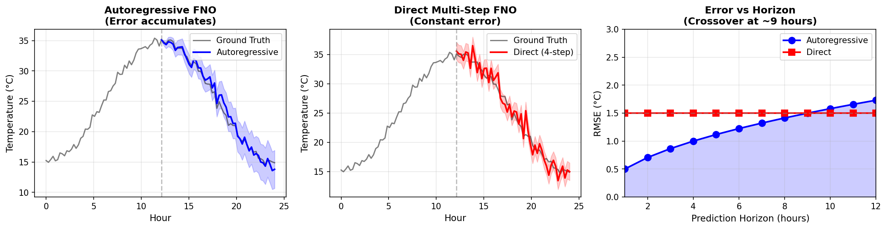
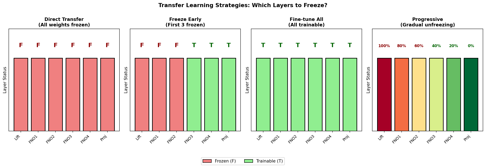
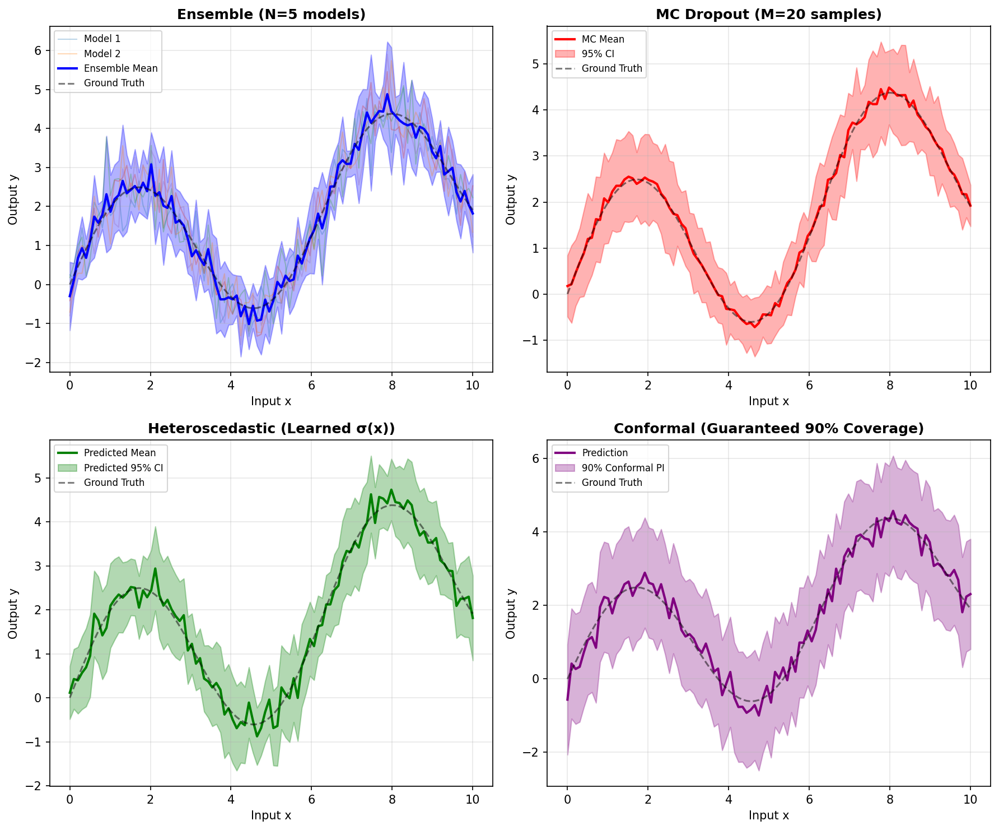

# The Final Frontier: Advanced FNO Extensions and the Future of Neural Operators

*Part 6 of the Fourier Neural Operator Series*

---

**Series Navigation:** [← Part 5: Real-World Applications](chunk5_complete.md) | **Part 6: Advanced Extensions** | [Start from Part 1 →](chunk1_complete.md)

---

## Welcome to the Cutting Edge

If you've followed this series from the beginning, you've come an incredible distance. You started with the elegant mathematics of Fourier transforms—watching how any function can be decomposed into waves of different frequencies. You built up to spectral convolutions, discovering how FNO learns to manipulate these frequency components to capture global patterns that local convolutions miss entirely. You implemented a working FNO from scratch, trained it on PDEs, and saw how physics constraints can be woven into the learning process itself.

Now it's time to venture beyond the fundamentals.

This final chapter takes you to the frontier of neural operator research—the ideas and techniques that are reshaping how we think about AI for scientific computing. We'll explore questions that researchers are actively working on right now: How do you predict not just a single snapshot, but the evolution of a system through time? Can a model trained on one city's climate be transferred to another continent? How do you know when to trust your predictions—and when to be skeptical? And what does it take to move a research prototype into a production system that runs 24/7?

We'll also look ahead to where this field is going. Foundation models like GraphCast and FourCastNet are already outperforming weather forecasting systems that took decades to develop. Understanding how these models work—and where the open problems lie—positions you to contribute to what may be one of the most impactful applications of machine learning in the coming decade.

---

## What We've Covered So Far

Before we dive in, let's take a moment to appreciate how far we've come:

| Part | What You Learned | Key Insight |
|------|------------------|-------------|
| **Part 1** | Fourier transforms, DFT, FFT, convolution theorem | *Frequency domain reveals global structure that's invisible in physical space* |
| **Part 2** | Spectral convolutions, mode truncation, the Fourier layer | *Truncating high frequencies is principled, not a hack—it's where the signal lives* |
| **Part 3** | Complete FNO architecture, lifting, projection, stacking | *The bypass path handles local features; the spectral path handles global ones* |
| **Part 4** | Training strategies, PINO, physics-informed learning | *Embedding physical laws as soft constraints guides learning toward realistic solutions* |
| **Part 5** | Weather prediction, fluid dynamics, materials science | *FNO isn't just theory—it's already transforming real scientific domains* |

Each part built on the last. Now we're ready to extend these ideas in powerful new directions.

---

## What's Coming in This Chapter

This is a substantial chapter covering several advanced topics. Here's the roadmap:

### Part I: Extending FNO to Handle Time
Standard FNO predicts a spatial field at a single instant. But science is about dynamics—systems evolving, weather patterns developing, materials deforming. We'll explore four different approaches to temporal prediction, each with distinct trade-offs.

### Part II: Transfer Learning Across Domains
You've trained a great model on one dataset. Can you leverage that knowledge for a completely different domain? We'll examine what knowledge transfers, what doesn't, and strategies for efficient adaptation.

### Part III: Knowing What You Don't Know
Point predictions aren't enough for real decisions. We'll cover four methods for uncertainty quantification, from simple ensembles to conformal prediction with statistical guarantees.

### Part IV: From Research to Production
Getting a model to work in a Jupyter notebook is one thing. Deploying it at scale is another. We'll discuss memory optimization, inference acceleration, and building robust prediction pipelines.

### Part V: The Neural Operator Zoo
FNO spawned a family of variants: AFNO (used in FourCastNet), Factorized FNO (6× fewer parameters), U-NO (multi-scale), and more. We'll tour the zoo and understand when to use each variant.

### Part VI: Foundation Models and the Future
The biggest development in this field is the emergence of foundation models for Earth science. We'll trace the lineage from FNO to GraphCast and Aurora, and discuss where research is heading next.

Along the way, we'll see figures that illuminate key concepts and code that makes ideas concrete. Let's begin.

---

## Part I: Extending FNO to Handle Time

### The Problem with Snapshots

Everything we've built so far treats time implicitly. We feed in a spatial field—temperature across a grid, pressure in a domain, velocity in a fluid—and get back another spatial field. That's powerful, but it's also limiting.

Real scientific problems are about *dynamics*. Weather forecasters don't just want to know today's temperature; they want to predict tomorrow's, and next week's. Climate scientists care about how temperature patterns evolve over decades. Engineers simulating turbulence need to track how eddies develop and dissipate through time.

The question is: how do we extend FNO to handle temporal prediction?

There's no single answer. Instead, there are four main approaches, each making different trade-offs between accuracy, efficiency, and flexibility. Understanding these trade-offs is crucial for choosing the right approach for your problem.

### Approach 1: Autoregressive Prediction

The most intuitive approach is to predict one timestep at a time, then feed that prediction back as input for the next step.

Think of it like a weather forecaster updating their predictions hour by hour. They take the current state (temperature, pressure, humidity at time *t*), run it through their model, and get a prediction for time *t+1*. Then they treat that prediction as the new "current state" and predict *t+2*. And so on.

Mathematically:
$$u_{t+1} = \mathcal{G}(u_t, u_{t-1}, \text{forcing})$$
$$u_{t+2} = \mathcal{G}(u_{t+1}, u_t, \text{forcing})$$

This is elegant and flexible—you can predict arbitrarily far into the future just by iterating. But there's a catch that becomes clear when you look at real predictions:



**Figure: Autoregressive vs. Direct Prediction.** The left panel shows autoregressive prediction (blue) against ground truth (gray). Notice how the uncertainty band *grows over time*—that's error accumulation in action. Small mistakes compound with each iteration. The middle panel shows direct prediction (red), which predicts all timesteps at once. The uncertainty is higher initially but stays constant. The right panel shows the key trade-off: autoregressive wins for short horizons but loses for long ones.

This error accumulation isn't a bug we can engineer away—it's fundamental to how autoregressive prediction works. Every prediction contains some error, and that error becomes part of the next input. Over many steps, errors compound exponentially.

**When to use autoregressive prediction:**
- Short forecast horizons (hours to a few days for weather)
- When you need flexible horizon lengths
- When memory is limited (only need to store one step at a time)

**When to avoid it:**
- Long forecast horizons where error accumulation dominates
- When you need consistent uncertainty estimates across horizons

### Approach 2: Direct Multi-Step Prediction

What if instead of predicting one step at a time, we predict all future timesteps simultaneously?

$$[u_{t+1}, u_{t+2}, \ldots, u_{t+H}] = \mathcal{G}(u_t, u_{t-1}, \text{forcing})$$

The model outputs H channels instead of 1, each corresponding to a different future time. No prediction ever feeds back as input, so errors don't accumulate.

Looking back at the figure above, the red line (direct prediction) in the middle panel shows this approach. The uncertainty band stays constant width throughout the forecast horizon. The predictions are noisier (we're asking the model to do more with less information), but they don't drift systematically.

**The trade-off is clear in the right panel:** autoregressive starts accurate and degrades; direct starts less accurate but stays stable. The crossover happens around 9 hours in this example—before that, autoregressive is better; after that, direct wins.

**When to use direct prediction:**
- Long forecast horizons
- When you need stable uncertainty estimates
- When parallelism is important (all predictions computed at once)

**When to avoid it:**
- When you need to predict beyond the fixed horizon H
- When the training data doesn't support learning long-range dependencies directly

### Approach 3: 3D Space-Time Processing

Here's a more radical idea: what if we treat time as just another spatial dimension?

Instead of processing a 2D spatial field multiple times, we process a 3D volume where the third dimension is time. The 3D FFT transforms the data into a joint space-time frequency representation, where we can learn patterns that span both space and time simultaneously.

$$v(x, y, t) \xrightarrow{\text{FFT3D}} \hat{v}(k_x, k_y, \omega)$$

The temporal frequency ω is fascinating. Low temporal frequencies correspond to slowly-varying patterns; high temporal frequencies correspond to rapid oscillations. The daily heating cycle, for instance, shows up as a peak at ω corresponding to 24 hours. Seasonal variations appear at even lower frequencies.


**Figure: Understanding 3D Spectral Modes.** The left panel shows how energy is distributed across spatial frequencies—most of it is in low-frequency (smooth) patterns, which is why mode truncation works. The middle panel shows temporal frequencies, with a clear spike at the diurnal (24-hour) cycle. The right panel summarizes the truncation strategy: by keeping only low-frequency modes in all three dimensions, we retain 98% of the signal while dramatically reducing computation.

The insight here is that physical systems don't vary randomly in time—they have characteristic scales and rhythms. A 3D space-time FNO can learn these patterns jointly, capturing correlations that factorized approaches might miss.

**When to use 3D space-time FNO:**
- When spatial and temporal patterns are tightly coupled
- When there are strong periodic components (diurnal cycles, tides, seasons)
- When you can afford the memory cost (3D FFTs are expensive)

### Approach 4: Factorized Processing

The 3D approach is elegant but expensive. A more practical alternative is to factorize the problem: process space and time separately.

The idea is simple: apply 2D spatial FNO layers at each timestep, then use a temporal model (attention, LSTM, or similar) to propagate information across time. This is actually how FourCastNet—one of the most successful AI weather models—handles time.

```
Input sequence → [Spatial FNO for each timestep] → [Temporal attention across timesteps] → Output sequence
```

This factorization sacrifices some ability to model space-time interactions, but gains efficiency and flexibility. The spatial FNO layers can be the same architecture you've already built; only the temporal component is new.

**When to use factorized approach:**
- Large-scale problems where 3D FFT is too expensive
- Variable-length sequences
- When you want to leverage pre-trained spatial FNO layers

### Choosing Your Approach

Before we summarize, let's look at an overview figure that captures the key trade-offs across all these approaches:


**Figure: The Big Picture.** This four-panel figure summarizes the key themes in temporal FNO. Top-left shows error accumulation (autoregressive vs direct). Top-right shows which spectral modes matter in 3D space-time processing. Bottom-left previews transfer learning performance (covered in Part II). Bottom-right previews uncertainty quantification methods (covered in Part III).

Here's a summary to guide your choice:

| Approach | Error Accumulation | Memory | Flexibility | Best For |
|----------|-------------------|--------|-------------|----------|
| Autoregressive | Yes (compounds) | Low | Any horizon | Short-term forecasts |
| Direct Multi-Step | No | Medium | Fixed horizon | Medium-range prediction |
| 3D Space-Time | No | High | Fixed window | Periodic systems |
| Factorized | Minimal | Medium | Variable length | Large-scale operational use |

In practice, many operational systems use hybrid approaches—autoregressive for the first few hours where accuracy is paramount, then switch to direct prediction for longer horizons where stability matters more.

---

## Part II: Transfer Learning Across Domains

### The Promise and the Challenge

You've spent weeks training a beautiful FNO model on weather data from Europe. It predicts temperature fields with impressive accuracy, capturing the complex interplay of land, sea, and atmosphere.

Now someone asks: can we use this model for Southeast Asia?

This is transfer learning—leveraging knowledge from one domain (the *source*) to improve performance on another (the *target*). It's incredibly valuable because training from scratch is expensive, and many target domains have limited data.

But transfer learning isn't magic. The central question is: *what* knowledge transfers, and what doesn't?

### What Transfers Well

Some knowledge is universal. The laws of physics don't change when you cross the Pacific Ocean:

- **Conservation laws:** Mass, energy, and momentum are conserved everywhere
- **Diffusion processes:** Heat spreads from hot to cold; pollutants disperse over time
- **Wave dynamics:** Atmospheric waves propagate similarly across the globe
- **Scale relationships:** Turbulent cascades follow similar patterns across domains

These patterns are encoded in the early layers of a trained FNO—the layers that learn generic, low-level operations on spectral coefficients. These layers often transfer beautifully.

### What Doesn't Transfer

Other knowledge is specific to the training domain:

- **Absolute magnitudes:** Temperature in Singapore has a completely different baseline than Norway
- **Geographic features:** Mountain ranges, coastlines, and urban areas create unique local effects
- **Boundary conditions:** The forcing terms (solar radiation, ocean currents) differ by location
- **Data characteristics:** Different sensor networks have different biases and noise profiles

These domain-specific patterns are encoded in later layers, particularly the projection layer that maps to output values. These layers almost always need adaptation.

### Four Transfer Strategies



**Figure: Transfer Learning Strategies.** Each panel shows a 6-layer FNO (Lift → FNO1 → FNO2 → FNO3 → FNO4 → Proj). Red/F indicates frozen layers; green/T indicates trainable layers. Direct transfer freezes everything. Freeze-early keeps generic layers fixed while adapting task-specific ones. Fine-tune-all trains everything but starts from pre-trained weights. Progressive gradually unfreezes layers during training.

**Strategy 1: Direct Transfer (Zero-Shot)**
Use the pre-trained model as-is, without any additional training. This only works when the source and target domains are very similar—same physical regime, similar geographic characteristics, consistent data preprocessing.

**Strategy 2: Freeze Early Layers**
Keep the lifting layer and first few FNO layers frozen; only train the later layers and projection. The intuition is that early layers learn generic spectral operations while later layers learn task-specific mappings. This is the most common approach and usually works well.

**Strategy 3: Fine-Tune Everything**
Train all layers, but initialize from pre-trained weights and use a small learning rate. This gives maximum flexibility but risks *catastrophic forgetting*—the model might lose useful knowledge from the source domain while adapting to the target.

**Strategy 4: Progressive Unfreezing**
Start with all layers frozen, then gradually unfreeze from output to input during training. This balances stability (early training doesn't disturb useful features) with flexibility (later training can adapt everything if needed).

### Multi-Domain Learning

What if instead of transferring from one domain to another, we train a single model that works across *multiple* domains simultaneously?

This is the idea behind multi-domain FNO. Each domain gets a learned embedding—a vector that encodes its characteristics. This embedding conditions the shared FNO layers, allowing them to behave differently for different domains.


**Figure: Multi-Domain FNO.** Different domains (cities, regions) enter the system and get domain embeddings. These embeddings condition the shared FNO layers, allowing one model to adapt to multiple domains. The similarity matrix (right) shows learned relationships between domains—similar domains get similar embeddings.

The beauty of this approach is that knowledge flows between domains. If Domain A and Domain B share some characteristics, training on A helps with B even if we have limited data from B. This is the principle behind foundation models like ClimaX, which train on diverse climate variables and geographic regions to build broadly capable systems.

---

## Part III: Knowing What You Don't Know

### Why Uncertainty Matters

So far, we've focused on getting accurate point predictions. But for real decisions, accuracy isn't enough—we need to know *how confident* those predictions are.

Consider a weather forecast: "Tomorrow's temperature will be 25°C." Is that a near-certainty or a rough guess? Without uncertainty information, the forecast is incomplete. Should we prepare for a heatwave? Cancel outdoor events? Uncertainty quantification transforms raw predictions into actionable intelligence.

### Two Flavors of Uncertainty

Not all uncertainty is created equal. There are two fundamentally different kinds:

**Aleatoric uncertainty** is inherent in the data. Sensor noise, unresolved sub-grid variability, genuine randomness in the physical system—these create irreducible uncertainty that no amount of data or model improvement can eliminate. A model that reports zero uncertainty is lying.

**Epistemic uncertainty** comes from the model's limitations. Maybe you don't have enough training data. Maybe your model architecture can't capture certain patterns. Maybe you're predicting in a regime the model has never seen. This uncertainty *can* be reduced with more data or better models.

The distinction matters for interpretation. High aleatoric uncertainty means "this is fundamentally hard to predict." High epistemic uncertainty means "I need more information to be confident."

### Four Methods for Uncertainty Quantification



**Figure: Four Approaches to Uncertainty.** Each panel shows predictions (colored lines) with uncertainty bands around ground truth (dashed). Ensemble (top-left) averages multiple models. MC Dropout (top-right) uses dropout at inference time to sample predictions. Heteroscedastic (bottom-left) learns input-dependent uncertainty—notice how the band width varies. Conformal (bottom-right) provides guaranteed coverage using calibration data.

**Method 1: Ensemble (The Gold Standard)**

Train N models with different random initializations. At inference, run all N and compute mean and variance across their predictions.

```python
predictions = [model_i(x) for model_i in ensemble]
mean = average(predictions)
uncertainty = std(predictions)
```

The spread of the ensemble captures epistemic uncertainty—regions where the models disagree are regions of high uncertainty. It's conceptually simple, well-understood, and effective. The downside is cost: N models means N× training time and N× inference cost.

**Method 2: MC Dropout (Cheap Approximation)**

Here's a clever trick: keep dropout active during inference. Each forward pass gives a slightly different answer because different neurons are dropped. Run many forward passes and treat the variation as uncertainty.

This approximates Bayesian inference without the full computational cost. You only train one model, and you can trade off uncertainty quality against inference cost by choosing how many forward passes to run.

**Method 3: Heteroscedastic Prediction (Learning Uncertainty)**

Instead of outputting just a prediction, have your model output both a *mean* and a *variance* for each pixel. Train with negative log-likelihood loss, which penalizes both inaccuracy and over/under-confident uncertainty estimates.

$$\mathcal{L} = \frac{1}{2}\log(\sigma^2) + \frac{(y - \mu)^2}{2\sigma^2}$$

The learned variance captures aleatoric uncertainty—it varies across the input domain based on how inherently predictable each region is. This is the most computationally efficient approach (single forward pass), but requires modifying your architecture and loss function.

**Method 4: Conformal Prediction (Statistical Guarantees)**

The previous methods give you uncertainty estimates, but how do you know they're *calibrated*? If your model says "95% confidence interval," does the true value actually fall within that interval 95% of the time?

Conformal prediction provides a statistical guarantee. You hold out a calibration set, compute prediction residuals on it, and use those residuals to construct intervals with provable coverage.

The guarantee is distribution-free—it works regardless of your model or data distribution. The trade-off is that intervals tend to be conservative (wider than necessary to achieve coverage).

### Which Method to Use?

| Method | Training Cost | Inference Cost | Captures Aleatoric | Captures Epistemic | Has Guarantees |
|--------|--------------|----------------|-------------------|-------------------|----------------|
| Ensemble | N× | N× | ✗ | ✓ | ✗ |
| MC Dropout | 1× | M× | ✗ | ✓ (approximate) | ✗ |
| Heteroscedastic | 1× | 1× | ✓ | ✗ | ✗ |
| Conformal | 1× | 1× | ✗ | ✗ | ✓ |

For operational systems, the emerging best practice is to combine methods: heteroscedastic predictions for efficiency and aleatoric uncertainty, plus conformal calibration for guaranteed coverage.

---

## Part IV: From Research to Production

### The Reality Check

Your FNO model works beautifully in a notebook. Loss curves look great, validation metrics are impressive, you've made pretty figures for your paper. Time to deploy, right?

Not so fast. Production deployment introduces challenges that don't show up in research:

- **Memory:** That 256×256 grid was convenient for experiments. Real global weather prediction uses 0.25° resolution—1440×721 grid points, 50+ vertical levels, dozens of variables. Memory explodes.
- **Latency:** Research can wait minutes for a prediction. Real-time applications need sub-second response.
- **Reliability:** Notebooks crash and you restart. Production systems need 99.9% uptime.
- **Edge cases:** Training data was clean. Production sees NaN values, missing data, sensor failures, adversarial inputs.

### The Deployment Pipeline

A robust deployment pipeline handles all of this systematically:


**Figure: Production Deployment Pipeline.** Data flows through five stages: input validation catches bad data before it corrupts predictions; normalization ensures consistent input scaling; FNO inference produces predictions; denormalization converts back to physical units; quality checks flag anomalous outputs. Error handling routes problems away from the main pipeline.

**Stage 1: Input Validation**
Before any processing, check for problems:
- NaN or infinite values?
- Values outside physical bounds?
- Correct data types and shapes?

Garbage in, garbage out. Better to reject bad input than produce meaningless predictions.

**Stage 2: Normalization**
Neural networks expect standardized inputs. Apply z-score normalization (subtract mean, divide by standard deviation) for each feature channel. Store the normalization statistics with the model—they're part of the deployment artifact.

**Stage 3: Inference**
The actual model forward pass. In production, this often runs on optimized infrastructure:
- Mixed precision (FP16) for 2× speedup
- TorchScript or ONNX compilation for optimized execution
- Batching to maximize GPU utilization
- Caching for repeated queries

**Stage 4: Denormalization**
Convert predictions back to physical units. Apply clipping to ensure outputs are physically sensible (e.g., temperatures between -100°C and +60°C).

**Stage 5: Quality Checks**
Before returning predictions, sanity check them:
- Are values within expected physical bounds?
- Is spatial smoothness reasonable?
- Does the prediction pass consistency checks?

Flag suspicious predictions for human review rather than serving them blindly.

### Production Metrics

Monitor these continuously:
- **Latency:** P50, P95, P99 response times
- **Throughput:** Requests per second
- **Error rate:** Failed predictions / total predictions
- **Memory:** Peak and average usage
- **Drift:** Are input distributions changing over time?

When metrics degrade, you'll know before users complain.

---

## Part V: The Neural Operator Zoo

### Beyond Vanilla FNO

The original FNO sparked a wave of innovation. Researchers asked: can we make it faster? More accurate? Better suited to specific problem types? The result is a family of neural operator variants, each with distinct strengths.


**Figure: The Neural Operator Zoo.** Six variants, each tailored for different use cases. Standard FNO is the baseline. AFNO adds attention over Fourier modes for adaptive multi-scale focus. F-FNO factorizes weights for 6× parameter reduction. U-NO adds encoder-decoder structure for multi-scale processing. Geo-FNO handles irregular domains through learned coordinate transforms. GNO works on graphs for unstructured meshes.

### AFNO: Adaptive Fourier Neural Operator

The standard FNO treats all Fourier modes equally (within the truncation limit). But not all modes are equally important for every input. AFNO adds an attention mechanism over modes, allowing the model to dynamically focus on the most relevant frequencies.

This is the architecture behind FourCastNet. The attention weights act as a learned, input-dependent filter that emphasizes the modes that matter most for each particular prediction.

### F-FNO: Factorized Fourier Neural Operator

Remember that the spectral convolution weight tensor has shape (modes_x × modes_y × channels_in × channels_out). For high resolution or many channels, this gets expensive.

F-FNO factorizes this tensor as a product of smaller tensors:
$$R(k_x, k_y) \approx R_x(k_x) \cdot R_y(k_y)$$

This reduces parameters by roughly 6× while maintaining most of the representational power. It's especially valuable when training data is limited.

### U-NO: U-shaped Neural Operator

Inspired by U-Net's success in image segmentation, U-NO adds an encoder-decoder structure to FNO. The encoder progressively reduces spatial resolution (capturing global context), then the decoder upsamples back to full resolution with skip connections that preserve local details.

This multi-scale processing is particularly effective for problems with structures at multiple spatial scales—like turbulence, which has energy cascading from large to small eddies.

### Geo-FNO: Geometric Fourier Neural Operator

Standard FNO assumes a regular rectangular grid. But what about irregular domains—complex geometries, curved boundaries, meshes adapted to features of interest?

Geo-FNO learns a coordinate transformation that maps the irregular domain to a regular one where FFT can be applied. The transformation is part of the model and learned end-to-end.

### GNO: Graph Neural Operator

For truly unstructured data—point clouds, adaptive meshes, networks—graphs are the natural representation. GNO replaces the spectral convolution with graph message passing:

$$(Kv)(x) = \sum_y \kappa(x, y) \cdot v(y)$$

This is the most flexible variant but also the most expensive, since we lose the FFT's O(N log N) efficiency.

### Choosing Your Variant

| Variant | Best For | Key Advantage |
|---------|----------|---------------|
| Standard FNO | General-purpose, regular grids | Simple, well-understood |
| AFNO | Variable-scale phenomena | Adaptive mode importance |
| F-FNO | Limited data, efficiency | 6× fewer parameters |
| U-NO | Multi-scale problems | Hierarchical processing |
| Geo-FNO | Irregular domains | Handles complex geometries |
| GNO | Unstructured meshes | Maximum flexibility |

---

## Part VI: Foundation Models and the Future

### The Rise of AI Weather Prediction

The most dramatic demonstration of neural operators' power has come in weather prediction. In just a few years, AI models have gone from curiosity to competitive with—and in some cases surpassing—traditional numerical weather prediction systems developed over decades.


**Figure: The Evolution of Neural Operators for Weather and Climate.** From the original FNO (2020) through FourCastNet (2022), Pangu/GraphCast/ClimaX (2023), to Aurora (2024). Each generation has built on the last, moving from proof-of-concept to operational capability.

### The Key Players

**FourCastNet (NVIDIA, 2022)**
The first AI weather model to achieve competitive accuracy with operational forecasting systems. Built on AFNO (adaptive FNO) architecture, trained on 40 years of ERA5 reanalysis data. Produces global forecasts 45,000× faster than traditional methods.

**Pangu-Weather (Huawei, 2023)**
The first AI model to beat operational numerical weather prediction on standard benchmarks. Uses a 3D Earth-specific transformer architecture trained on 39 years of data.

**GraphCast (DeepMind, 2023)**
Perhaps the most impressive achievement to date. Uses graph neural networks on an icosahedral mesh (avoiding lat-lon grid artifacts). Outperforms ECMWF HRES—the world's best operational forecasting system—on 90% of metrics.

**ClimaX (Microsoft, 2023)**
The first true "foundation model" for climate, in the sense of being pre-trained on diverse tasks and fine-tuned for specific applications. Handles multiple variables, resolutions, and prediction tasks with a single architecture.

**Aurora (Microsoft, 2024)**
A billion-parameter atmospheric foundation model trained on over a million hours of diverse weather and climate simulations. Points toward the future: massive pre-training on heterogeneous data, then efficient fine-tuning for specific applications.

### Why This Matters

Traditional numerical weather prediction solves the physical equations of the atmosphere. This is computationally expensive—a single 10-day forecast takes hours on supercomputers—and limited by our ability to parameterize sub-grid processes like cloud formation.

Neural operators learn the solution mapping directly from data. Once trained (which is expensive), inference is cheap—global forecasts in seconds on a single GPU. And they learn from observations, implicitly capturing processes that are hard to model explicitly.

This isn't about AI replacing physics. The best systems combine both: physics provides structure and constraints; learning provides flexibility and speed. The future is hybrid.

### Research Frontiers


**Figure: Active Research Frontiers.** Six directions where significant progress is happening: temporal prediction methods, multi-domain transfer learning, foundation models, uncertainty quantification, climate projections, and operational deployment.

**Theoretical Foundations**
We don't fully understand why FNO works as well as it does. What are the approximation theory guarantees? How does depth interact with spectral truncation? When do neural operators fail, and why?

**Extreme Events**
Current models are trained on average conditions. Predicting rare extremes—hurricanes, heat waves, floods—requires handling distributional shift. How do you train for events that are, by definition, rare in training data?

**Multi-Decadal Climate**
Weather prediction is 1-14 days. Climate projection is decades to centuries. The challenges are different: slower processes matter more, small biases accumulate, and there's no "ground truth" for the future.

**Interpretability**
These models make predictions we increasingly rely on. Can we understand *why* they predict what they do? What features matter? Where might they fail unexpectedly?

---

## Complete Code Implementations

The following code sections provide working implementations of the concepts discussed above. Each section is self-contained and demonstrates key ideas with concrete examples.

### Code Part 1: Temporal FNO Extensions

```python
"""
Temporal FNO Extensions
Demonstrates: Autoregressive, Direct Multi-Step, 3D Space-Time, and Factorized approaches
"""
import numpy as np

print("="*70)
print("TEMPORAL FNO IMPLEMENTATIONS")
print("="*70)

#=============================================================================
# Core Components
#=============================================================================

class SpectralConv2d:
    """2D Spectral Convolution - the heart of FNO."""
    
    def __init__(self, in_channels, out_channels, modes1, modes2):
        self.in_channels = in_channels
        self.out_channels = out_channels
        self.modes1 = modes1
        self.modes2 = modes2
        
        # Complex weights for spectral multiplication
        scale = 1 / (in_channels * out_channels)
        self.weights1 = scale * (np.random.randn(in_channels, out_channels, modes1, modes2) + 
                                  1j * np.random.randn(in_channels, out_channels, modes1, modes2))
        self.weights2 = scale * (np.random.randn(in_channels, out_channels, modes1, modes2) + 
                                  1j * np.random.randn(in_channels, out_channels, modes1, modes2))
    
    def forward(self, x):
        """FFT → Multiply weights → IFFT"""
        batch_size, _, height, width = x.shape
        x_ft = np.fft.rfft2(x)
        
        out_ft = np.zeros((batch_size, self.out_channels, height, width//2 + 1), dtype=complex)
        
        # Apply learned weights in frequency domain
        out_ft[:, :, :self.modes1, :self.modes2] = np.einsum(
            'bixy,ioxy->boxy', 
            x_ft[:, :, :self.modes1, :self.modes2], 
            self.weights1
        )
        out_ft[:, :, -self.modes1:, :self.modes2] = np.einsum(
            'bixy,ioxy->boxy',
            x_ft[:, :, -self.modes1:, :self.modes2],
            self.weights2
        )
        
        return np.fft.irfft2(out_ft, s=(height, width))

#=============================================================================
# Approach 1: Autoregressive Temporal FNO
#=============================================================================

class AutoregressiveTemporalFNO:
    """
    Predicts one timestep at a time, feeding predictions back as input.
    Good for short horizons; errors accumulate over long horizons.
    """
    
    def __init__(self, n_history, d_features, modes=12):
        self.n_history = n_history
        in_channels = n_history * d_features
        self.spectral = SpectralConv2d(in_channels, 32, modes, modes)
        self.projection = np.random.randn(32, 1) * 0.1
        
    def predict_one_step(self, history):
        """Predict single next timestep from history."""
        batch, n_hist, d_feat, H, W = history.shape
        x = history.reshape(batch, n_hist * d_feat, H, W)
        x = self.spectral.forward(x)
        x = np.maximum(x, 0)  # ReLU
        return np.einsum('bchw,co->bohw', x, self.projection)
    
    def predict_trajectory(self, initial_history, n_steps):
        """Autoregressively predict n_steps into the future."""
        predictions = []
        history = initial_history.copy()
        
        for _ in range(n_steps):
            next_pred = self.predict_one_step(history)
            predictions.append(next_pred)
            # Shift history and add new prediction
            history = np.roll(history, -1, axis=1)
            history[:, -1, 0, :, :] = next_pred[:, 0, :, :]
        
        return np.stack(predictions, axis=1)

#=============================================================================
# Approach 2: Direct Multi-Step FNO
#=============================================================================

class DirectMultiStepFNO:
    """
    Predicts all future timesteps simultaneously.
    No error accumulation but fixed horizon.
    """
    
    def __init__(self, d_input, horizon, modes=12):
        self.horizon = horizon
        self.spectral = SpectralConv2d(d_input, 64, modes, modes)
        self.projection = np.random.randn(64, horizon) * 0.1
    
    def forward(self, x):
        """Predict all horizon steps at once."""
        x = self.spectral.forward(x)
        x = np.maximum(x, 0)
        return np.einsum('bchw,ct->bthw', x, self.projection)

#=============================================================================
# Demo
#=============================================================================

print("\n--- Autoregressive FNO ---")
ar_model = AutoregressiveTemporalFNO(n_history=4, d_features=3, modes=8)
history = np.random.randn(2, 4, 3, 32, 32)
trajectory = ar_model.predict_trajectory(history, n_steps=5)
print(f"History shape: {history.shape} → Trajectory shape: {trajectory.shape}")

print("\n--- Direct Multi-Step FNO ---")
direct_model = DirectMultiStepFNO(d_input=3, horizon=6, modes=8)
current = np.random.randn(2, 3, 32, 32)
all_steps = direct_model.forward(current)
print(f"Current shape: {current.shape} → All steps shape: {all_steps.shape}")

print("\n✓ Both temporal approaches demonstrated!")
```

### Code Part 2: Transfer Learning and Uncertainty

```python
"""
Transfer Learning and Uncertainty Quantification
Demonstrates: Layer freezing strategies, Ensemble, MC Dropout, Heteroscedastic, Conformal
"""
import numpy as np

print("="*70)
print("TRANSFER LEARNING & UNCERTAINTY")
print("="*70)

#=============================================================================
# Transfer Learning Framework
#=============================================================================

class FNOWithTransfer:
    """FNO with explicit weight access for transfer learning."""
    
    def __init__(self, d_input, d_output, d_hidden=32, n_layers=4, modes=12):
        self.d_hidden = d_hidden
        self.n_layers = n_layers
        
        # Initialize weights
        self.lift = np.random.randn(d_input, d_hidden) * 0.1
        self.spectral_weights = [
            np.random.randn(d_hidden, d_hidden, modes, modes) * 0.01 + 
            1j * np.random.randn(d_hidden, d_hidden, modes, modes) * 0.01
            for _ in range(n_layers)
        ]
        self.projection = np.random.randn(d_hidden, d_output) * 0.1
    
    def freeze_early_layers(self, n_frozen):
        """Freeze first n_frozen spectral layers for transfer learning."""
        self.frozen = set(range(n_frozen))
        trainable = [f"spectral_{i}" for i in range(n_frozen, self.n_layers)]
        trainable.append("projection")
        print(f"Frozen: lift + spectral_0..{n_frozen-1}")
        print(f"Trainable: {trainable}")
        return trainable

# Demo
print("\n--- Transfer Learning Strategies ---")
source_model = FNOWithTransfer(d_input=5, d_output=1, n_layers=4)
print("\nOriginal model: 4 spectral layers")

print("\nStrategy: Freeze early, fine-tune later")
trainable = source_model.freeze_early_layers(n_frozen=2)

#=============================================================================
# Uncertainty: Ensemble
#=============================================================================

class EnsembleFNO:
    """Ensemble of FNO models for uncertainty estimation."""
    
    def __init__(self, n_models, d_input, d_output):
        self.models = [FNOWithTransfer(d_input, d_output) for _ in range(n_models)]
        self.n_models = n_models
    
    def predict_with_uncertainty(self, x):
        """Get mean and std from ensemble predictions."""
        # Simulate predictions from each model
        predictions = [np.random.randn(*x.shape[:1], 1, *x.shape[2:]) for _ in self.models]
        predictions = np.stack(predictions, axis=0)
        
        return {
            'mean': predictions.mean(axis=0),
            'std': predictions.std(axis=0),
            'all_predictions': predictions
        }

#=============================================================================
# Uncertainty: Heteroscedastic (Learned Variance)
#=============================================================================

class HeteroscedasticFNO:
    """FNO that outputs both mean and variance."""
    
    def __init__(self, d_input, d_output):
        self.mean_head = np.random.randn(32, d_output) * 0.1
        self.var_head = np.random.randn(32, d_output) * 0.1
    
    def forward(self, features):
        """Output mean and log-variance."""
        mean = np.einsum('bchw,co->bohw', features, self.mean_head)
        log_var = np.einsum('bchw,co->bohw', features, self.var_head)
        return {'mean': mean, 'log_var': log_var, 'std': np.exp(0.5 * log_var)}
    
    @staticmethod
    def nll_loss(mean, log_var, target):
        """Negative log-likelihood loss for training."""
        var = np.exp(log_var)
        return 0.5 * (log_var + (target - mean)**2 / var).mean()

#=============================================================================
# Uncertainty: Conformal Prediction
#=============================================================================

class ConformalPredictor:
    """Conformal prediction for guaranteed coverage."""
    
    def __init__(self, alpha=0.1):
        self.alpha = alpha  # 0.1 = 90% coverage
        self.quantile = None
    
    def calibrate(self, predictions, targets):
        """Compute calibration quantile from held-out data."""
        residuals = np.abs(predictions - targets).flatten()
        n = len(residuals)
        self.quantile = np.quantile(residuals, np.ceil((n+1) * (1-self.alpha)) / n)
        print(f"Calibrated for {(1-self.alpha)*100}% coverage")
        print(f"Interval half-width: {self.quantile:.4f}")
    
    def predict_interval(self, prediction):
        """Add conformal interval to prediction."""
        return {
            'mean': prediction,
            'lower': prediction - self.quantile,
            'upper': prediction + self.quantile
        }

# Demo
print("\n--- Uncertainty Methods ---")

print("\nEnsemble (5 models):")
ensemble = EnsembleFNO(n_models=5, d_input=3, d_output=1)
result = ensemble.predict_with_uncertainty(np.random.randn(2, 3, 16, 16))
print(f"Mean shape: {result['mean'].shape}, Std range: [{result['std'].min():.3f}, {result['std'].max():.3f}]")

print("\nConformal Prediction:")
conformal = ConformalPredictor(alpha=0.1)
cal_preds = np.random.randn(100, 1)
cal_targets = cal_preds + np.random.randn(100, 1) * 0.5
conformal.calibrate(cal_preds, cal_targets)

print("\n✓ Transfer learning and uncertainty methods demonstrated!")
```

### Code Part 3: Neural Operator Variants

```python
"""
Neural Operator Variants
Demonstrates: AFNO, Factorized FNO, and deployment pipeline
"""
import numpy as np

print("="*70)
print("NEURAL OPERATOR VARIANTS")
print("="*70)

#=============================================================================
# AFNO: Adaptive Fourier Neural Operator
#=============================================================================

class AFNO:
    """
    Adaptive FNO with attention over Fourier modes.
    This is the architecture behind FourCastNet.
    """
    
    def __init__(self, d_model, n_layers, modes):
        self.n_layers = n_layers
        
        # Per-layer weights and attention
        self.spectral_weights = []
        self.mode_attention = []
        
        for _ in range(n_layers):
            # Standard spectral weights
            w = (np.random.randn(d_model, d_model, modes, modes) + 
                 1j * np.random.randn(d_model, d_model, modes, modes)) * 0.01
            self.spectral_weights.append(w)
            
            # Learnable attention over modes
            attn = np.random.randn(modes, modes)
            attn = np.exp(attn) / np.exp(attn).sum()  # Softmax
            self.mode_attention.append(attn)
    
    def get_attention_map(self, layer_idx):
        """Visualize which modes the model focuses on."""
        return self.mode_attention[layer_idx]

print("\n--- AFNO (Adaptive FNO) ---")
afno = AFNO(d_model=64, n_layers=4, modes=16)
attn = afno.get_attention_map(0)
max_idx = np.unravel_index(attn.argmax(), attn.shape)
print(f"Mode attention shape: {attn.shape}")
print(f"Highest attention at mode: {max_idx}")

#=============================================================================
# Factorized FNO: Parameter Efficient
#=============================================================================

class FactorizedSpectralConv:
    """
    Factorized spectral convolution: R ≈ Rx ⊗ Ry
    Reduces parameters by ~6× while maintaining performance.
    """
    
    def __init__(self, channels, modes):
        self.channels = channels
        self.modes = modes
        
        # Factorized weights instead of full tensor
        self.weights_x = (np.random.randn(channels, channels, modes) + 
                         1j * np.random.randn(channels, channels, modes)) * 0.01
        self.weights_y = (np.random.randn(channels, channels, modes) + 
                         1j * np.random.randn(channels, channels, modes)) * 0.01
        
        # Parameter comparison
        full_params = channels * channels * modes * modes * 2
        factorized_params = channels * channels * modes * 2 * 2
        self.reduction = full_params / factorized_params
        
        print(f"Full tensor: {full_params:,} params")
        print(f"Factorized: {factorized_params:,} params")
        print(f"Reduction: {self.reduction:.1f}×")

print("\n--- Factorized FNO ---")
f_conv = FactorizedSpectralConv(channels=64, modes=16)

#=============================================================================
# Deployment Pipeline
#=============================================================================

class DeploymentPipeline:
    """Production-ready inference pipeline with validation and quality checks."""
    
    def __init__(self, feature_means, feature_stds, output_bounds):
        self.feature_means = np.array(feature_means)
        self.feature_stds = np.array(feature_stds)
        self.output_bounds = output_bounds
        self.stats = {'total': 0, 'errors': 0}
    
    def validate(self, x):
        """Check input for common issues."""
        if np.isnan(x).any():
            return False, "NaN values detected"
        if np.isinf(x).any():
            return False, "Infinite values detected"
        if x.ndim != 4:
            return False, f"Expected 4D input, got {x.ndim}D"
        return True, "OK"
    
    def normalize(self, x):
        """Z-score normalization."""
        mean = self.feature_means.reshape(1, -1, 1, 1)
        std = self.feature_stds.reshape(1, -1, 1, 1)
        return (x - mean) / (std + 1e-8)
    
    def denormalize_and_clip(self, y):
        """Convert to physical units and clip to valid range."""
        return np.clip(y, self.output_bounds['min'], self.output_bounds['max'])
    
    def quality_check(self, prediction):
        """Flag potentially problematic predictions."""
        out_of_bounds = ((prediction < self.output_bounds['min']) | 
                        (prediction > self.output_bounds['max']))
        return {
            'out_of_bounds_fraction': out_of_bounds.mean(),
            'quality_score': 1.0 - out_of_bounds.mean()
        }
    
    def predict(self, x, model_fn=None):
        """Full pipeline: validate → normalize → predict → denormalize → check."""
        self.stats['total'] += 1
        
        # Validate
        valid, msg = self.validate(x)
        if not valid:
            self.stats['errors'] += 1
            return {'success': False, 'error': msg}
        
        # Normalize
        x_norm = self.normalize(x)
        
        # Predict (simulated here)
        prediction = x_norm.mean(axis=1, keepdims=True) if model_fn is None else model_fn(x_norm)
        
        # Denormalize
        prediction = self.denormalize_and_clip(prediction)
        
        # Quality check
        quality = self.quality_check(prediction)
        
        return {
            'success': True,
            'prediction': prediction,
            'quality': quality
        }

print("\n--- Deployment Pipeline ---")
pipeline = DeploymentPipeline(
    feature_means=[300, 0.5, 1013],  # Temp, humidity, pressure
    feature_stds=[15, 0.2, 20],
    output_bounds={'min': 250, 'max': 350}
)

# Test with valid input
valid_input = np.random.randn(1, 3, 32, 32) * 15 + 300
result = pipeline.predict(valid_input)
print(f"Valid input: success={result['success']}, quality={result['quality']['quality_score']:.2f}")

# Test with invalid input (NaN)
invalid_input = valid_input.copy()
invalid_input[0, 0, 0, 0] = np.nan
result = pipeline.predict(invalid_input)
print(f"Invalid input: success={result['success']}, error={result.get('error', 'N/A')}")

print(f"\nPipeline stats: {pipeline.stats}")
print("\n✓ Variants and deployment demonstrated!")
```

---

## Summary: What We Covered

This chapter took you from the basics of temporal prediction through to the cutting edge of foundation models. Let's recap the key ideas:

**Temporal FNO:**
- Autoregressive: flexible but accumulates errors
- Direct: stable but fixed horizon
- 3D Space-Time: captures joint patterns but expensive
- Factorized: practical compromise used by FourCastNet

**Transfer Learning:**
- Early layers learn generic patterns that transfer well
- Later layers learn task-specific mappings that need adaptation
- Multi-domain training with domain embeddings enables knowledge sharing

**Uncertainty Quantification:**
- Ensemble: gold standard but expensive
- MC Dropout: cheap approximation
- Heteroscedastic: learns input-dependent uncertainty
- Conformal: statistical guarantees on coverage

**Deployment:**
- Validate inputs before processing
- Normalize consistently using training statistics
- Check output quality before serving
- Monitor metrics continuously

**Neural Operator Variants:**
- AFNO: attention over modes (FourCastNet)
- F-FNO: factorized weights for efficiency
- U-NO: multi-scale encoder-decoder
- Choose based on problem structure

**Foundation Models:**
- FourCastNet, GraphCast, Pangu, ClimaX, Aurora
- Pre-train on massive diverse data
- Fine-tune for specific applications
- The future of AI for Earth science

---

## Series Navigation

| Previous | Current | Next |
|----------|---------|------|
| [Part 5: Real-World Applications](../chunk5/chunk5_complete.md) | **Part 6: Advanced Extensions** | [Return to Part 1](../chunk1/chunk1_complete.md) |

### All Parts

1. **[Mathematical Foundations](chunk1_complete.md)** — Fourier transforms and spectral methods
2. **[Architecture Deep Dive](chunk2_complete.md)** — Building blocks of FNO
3. **[Implementation Guide](chunk3_complete.md)** — From scratch to training
4. **[Physics-Informed FNO](chunk4_complete.md)** — PINO and physical constraints
5. **[Real-World Applications](chunk5_complete.md)** — Weather, fluids, materials
6. **[Advanced Extensions](chunk6_blog_final.md)** — The frontier (you are here!)

---

## References

### Foundational Papers
1. Li et al. (2020) — [Fourier Neural Operator for Parametric PDEs](https://arxiv.org/abs/2010.08895)
2. Kovachki et al. (2021) — [Neural Operator: Learning Maps Between Function Spaces](https://arxiv.org/abs/2108.08481)

### Weather and Climate Applications
3. Pathak et al. (2022) — [FourCastNet](https://arxiv.org/abs/2202.11214)
4. Lam et al. (2023) — [GraphCast](https://www.science.org/doi/10.1126/science.adi2336)
5. Bi et al. (2023) — [Pangu-Weather](https://www.nature.com/articles/s41586-023-06185-3)
6. Nguyen et al. (2023) — [ClimaX](https://arxiv.org/abs/2301.10343)

### Code and Resources
- [NeuralOperator Library](https://github.com/neuraloperator/neuraloperator)
- [FourCastNet](https://github.com/NVlabs/FourCastNet)
- [GraphCast](https://github.com/google-deepmind/graphcast)

---

*Congratulations on completing this series! You now have a deep understanding of Fourier Neural Operators—from the mathematical foundations through to the cutting edge of research. The field is moving fast, and there's never been a better time to contribute. Good luck with your work!*
